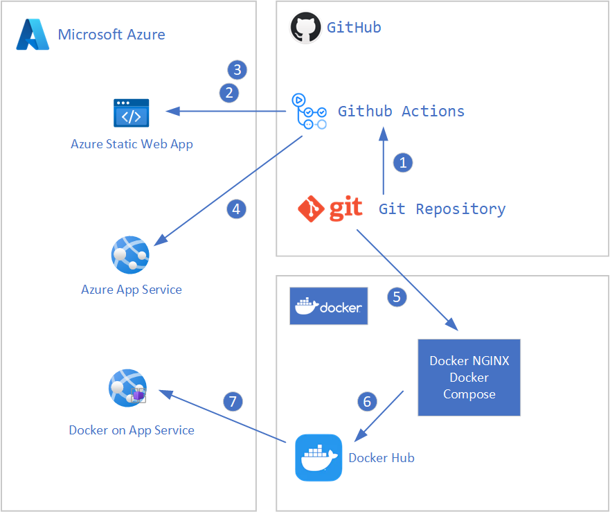

# **Getting started**

[Home](./../README.md) - [Challenge One](./01-Challenge1.md)

## **Introduction**

To deploy a web application the following lab environment is used.

## **High Level View**

The deployment of base infrastructure components like a Resource Group or the App Service is a one time deployment. In contrast the CI/CD deployment of a React web app is updating the web app on every commit to the repository.

## **Setup your resource group and publishing service**

You can use [the Bicep Deployment script](./../main.bicep) to setup the base components as a one-time deployment.

- Open Visual Studio Code and log in to Azure Cloud Shell at https://shell.azure.com/ and select Bash

`az login`

- Ensure Azure CLI and extensions are up to date:

`az upgrade --yes`

`az biceps upgrade`  or `az biceps install` (to install it)

- If necessary select your target subscription:

`az account set --subscription <Name or ID of subscription>`

- Update and set the `parameters-aa-join-example.json`

- Update and set the main.bicep parameters.

- Run the deployment with e.g.

`$location = "WestEurope"`

`$name="<your name>"`

`az deployment sub create --location $location -f ./main.bicep --parameters name=$name --parameters @parameters-ad-join-example.json -c`

### **Install VS Code Extensions**

  In VS Code install the git extension pack:

  

  Add the Bicep Extension to VS Code:

  

### **Install node in WSL:**
  
  We are goint to install node as described [here](https://learn.microsoft.com/en-us/windows/dev-environment/javascript/nodejs-on-wsl).

  `sudo apt-get install curl`

  `curl -o- https://raw.githubusercontent.com/nvm-sh/nvm/master/install.sh | bash`

  `command -v nvm`

  This should return `nvm`

  `nvm -v`

  This should return the version >= 0.39.2

  To install node enter the following:

  `nvm install node`

  `nvm ls`

  

  [Back to top](#01-build-your-modern-web-application)

## **Challenge 2: Adding a Bicep deployment to the project**

In this challenge we add the Bicep deployment to the project.
  
First we setup a folder structure in our project with the following folders:

- bicep-modules  
- parameters  
- pipelines
  
For having a "Bicep Hook", we create a file in the project root directory named main.bicep.
  
The result should look like this:

There is a Common Azure Resource Modules Library available [here](https://github.com/Azure/ResourceModules), that comes in versions. We use these modules in the deployment, so in the folder bicep-modules, a subfolder is created for the library named carml.
Below is the version number as folder, that contains the version of carml you choose to use when building your bicep deployment.
  
The result looks like this:

Now we are going to write the modules that are called from the main.bicep later. We need a module for the resource group creation in a subscription, and a module for setting up the static web app.
So we create two files in the folder bicep-modules:

- deploy-resourcegroup.bicep
- deploy-webapp.bicep

The result should look like this:

Developing in Bicep with this setup is a pleasure. Try to make use of the IntelliSense feature and the Bicep language support in VS Code. To start just type tar and wait for the suggestions to come up. Select targetScope from the list. Type = and press Strg+Space to see possible values for targetScope. It is very intuitive...

When calling modules in Bicep, the path is specified for the module.bicep file to call. A module can have output variables that are returned as an object to the name of the module in main.bicep. This helps to use results from modules later in the script, e.g. to deploy some service into a resource group. The output from module deploy-resourcegroup is used to initialize the module deploy-webapp.bicep.

Inside the module a resource can be created. Type res and wait for suggestions. Use resource and give that resource a name. Next is to select the API of the service. After the @ symbol, the APi version is selected.

[Back to top](#01-build-your-modern-web-application)

## **Challenge 3: Create a React Web App**

  To create a React Web App, run the following commands from the [root](./) folder of the project.
  Open the terminal in VS Code using the WSL distribution of your choice. from the project root folder   type:
  
  `npx create-react-app cloudastro-react-app`
  
  The following output is shown:
  
  
  
  This can take a minute or two.
  So we can now change into cloudastro-react-app and start a pre-build version of this app locally.
  
  When the setup of react web app is finished, the following output is shown:
  
  
  
  `cd cloudastro-react-app`
  
  `npm start`
  
  This brings up the React Web App to your default browser on [http://localhost:3000](http://localhost:3000)
  
  
  
  
  
  Now we can make some changes to the React Web App to align with the MicroHack.
  For that we are going to change the file App.js in the created folder [./cloudastro-react-app/src/App.js](./cloudastro-react-app/src/App.js)

  The result is shown like this:
  
  
  
  We are ready for a deployment, sice this web page only exist for demonstration of the possibilities.
  
  [Back to top](#01-build-your-modern-web-application)

## **Challenge 4: Commit to git and setup GitHub Action**

In this Challenge we are checking in the code to git and use GitHub to create a deployment action.
First we have to create a build version of the React Web App. for this type the following command:

`npm run build`

The result shoud look like this:

[Back to top](#01-build-your-modern-web-application)

## **Challenge 5: Deployment Ready**
