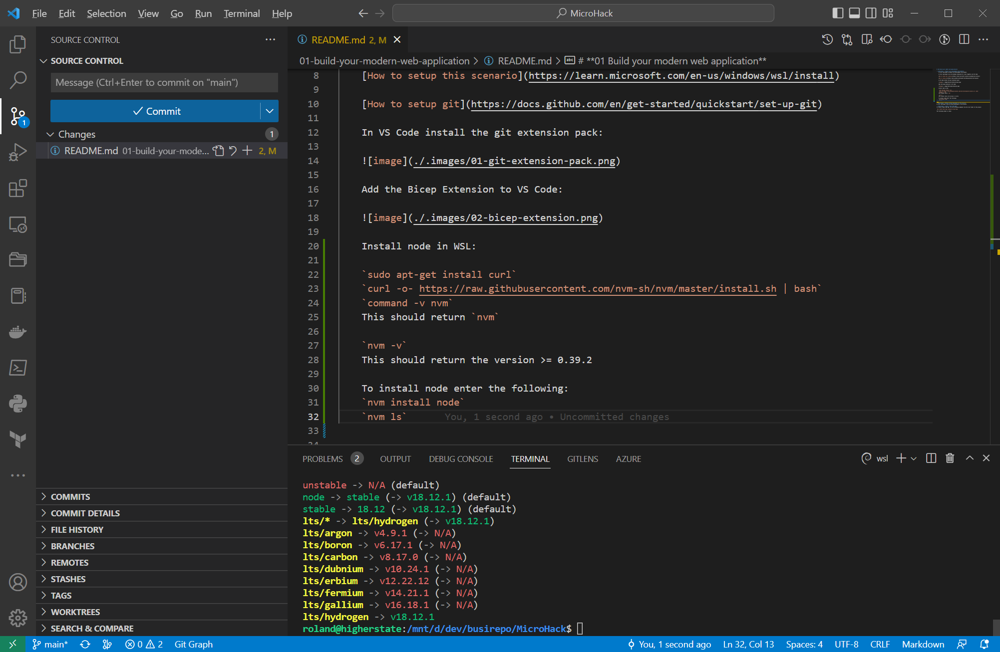
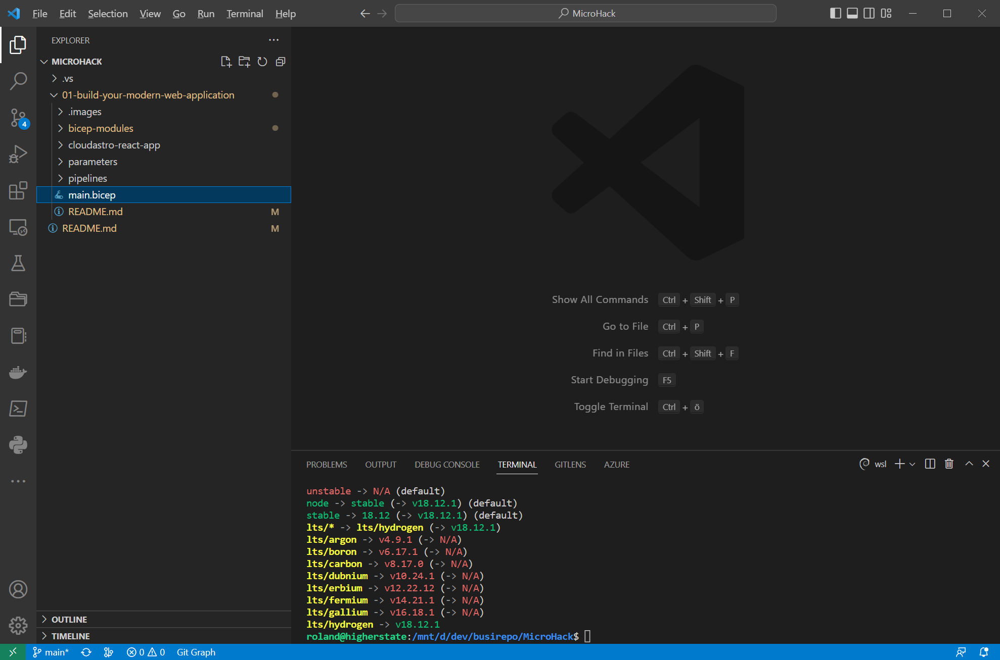
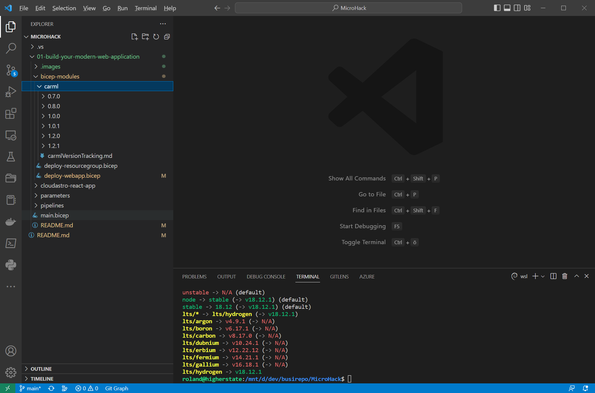
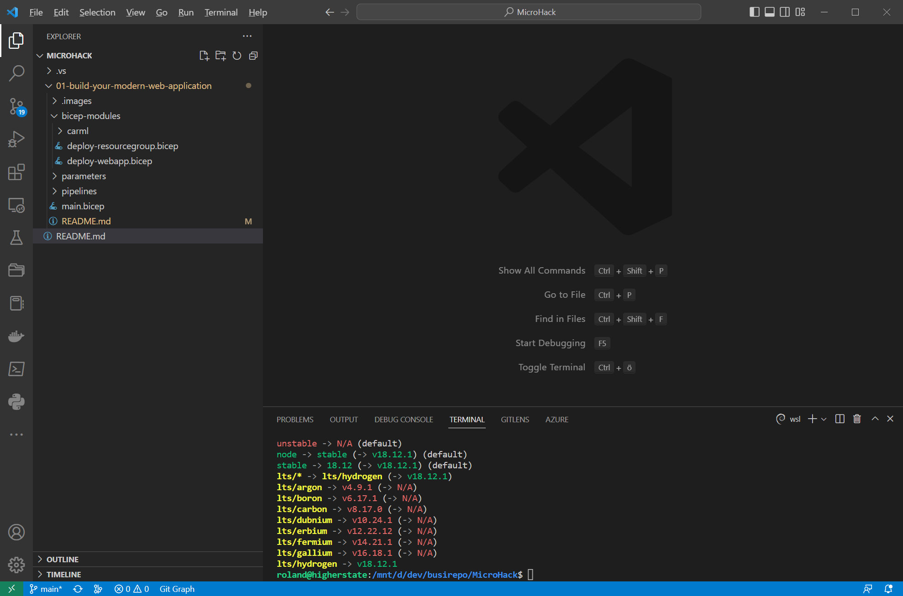
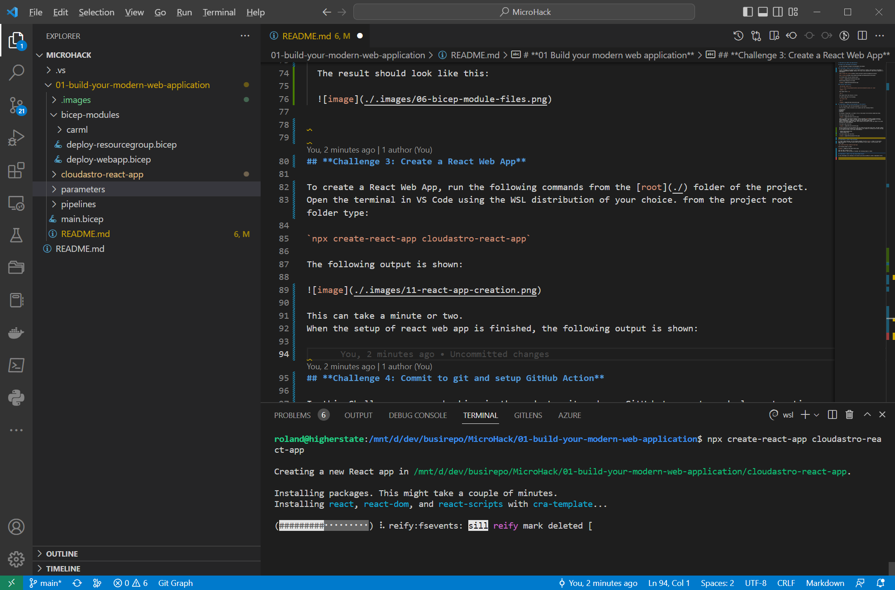
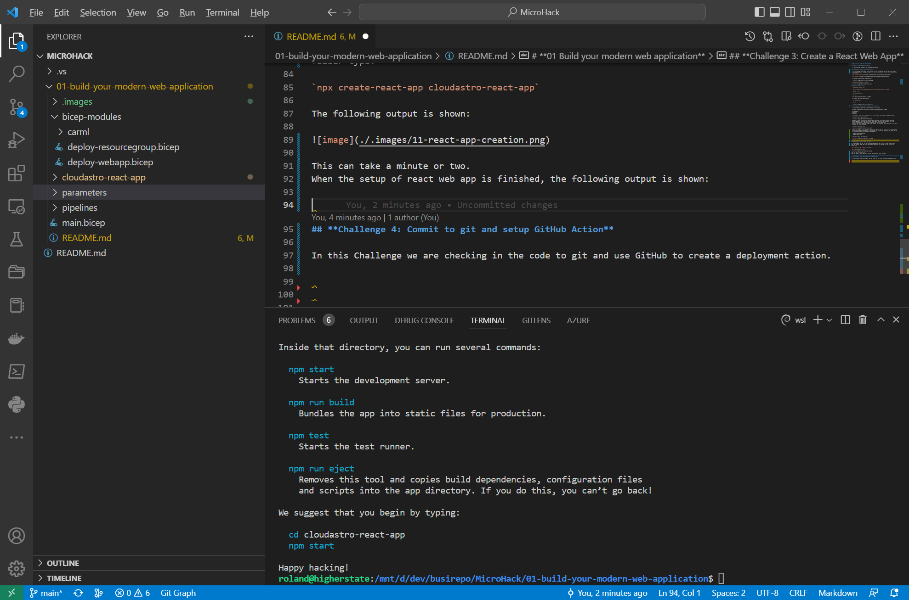
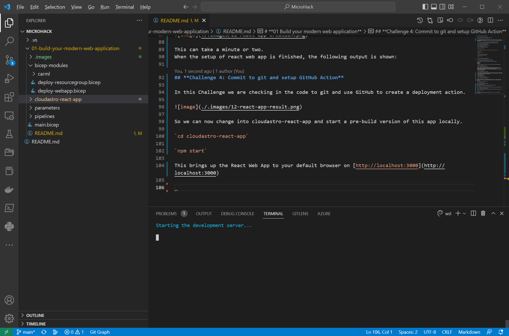
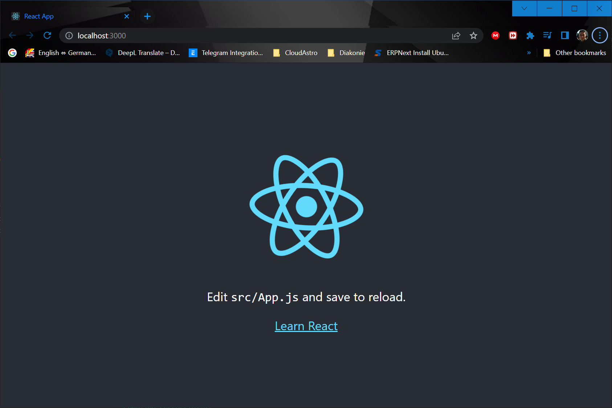
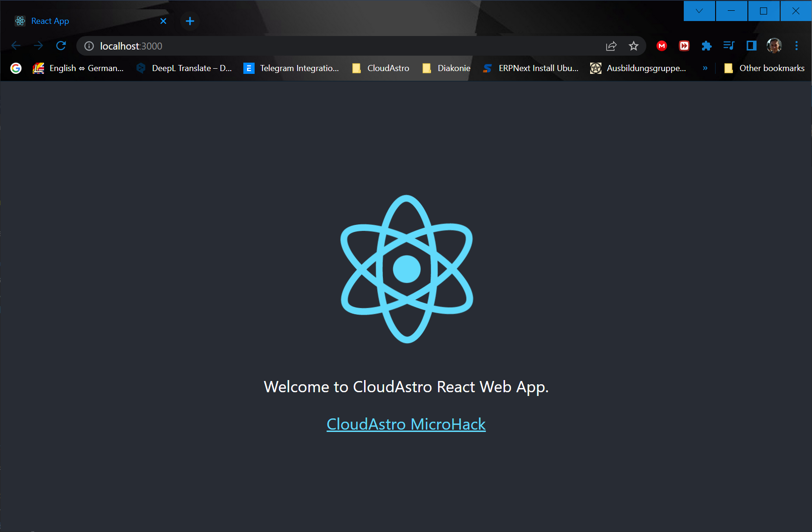
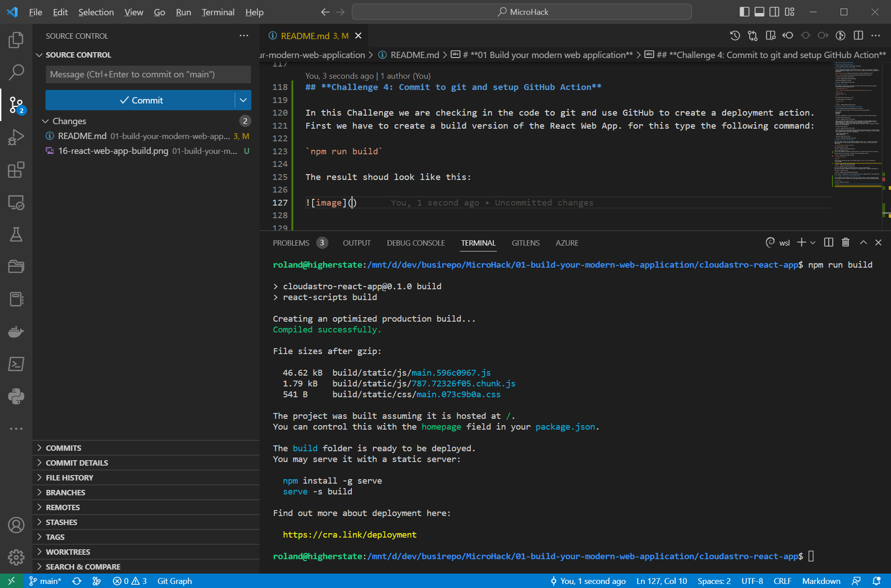

# **01 Build your modern web application**

- [Challenge 1:Deploy the lab environment](#challenge-1-deploy-the-lab-environment)
  - [Install VS Code Extensions](#prepare-your-development-environment)
  - [Install node in WSL](#install-node-in-wsl)
- [Challenge 2:Adding a bicep deployment](#challenge-2-adding-a-bicep-deployment-to-the-project)
- [Challenge 3:Create a React Web App](#challenge-3-create-a-react-web-app)
- [Challenge 4:Setup GitHub Actions](#challenge-4-commit-to-git-and-setup-github-action)
- [Challenge 5:Deployment Ready](#challenge-5-deployment-ready)

## Prepare your development environment**

  In this challenge we prepare the development environment.

### **Challenge 1: Deploy the lab environment.**

  In this challenge we are going to use VS Code with WSL to create a react web app. Since Node is used as a programming language, having a full stack linux subsystem for Open Source components is advantageous.

  [How to setup this scenario](https://learn.microsoft.com/en-us/windows/wsl/install)

  [How to setup git](https://docs.github.com/en/get-started/quickstart/set-up-git)

  In VS Code install the git extension pack:

  

  Add the Bicep Extension to VS Code:

  

### **Install node in WSL:**
  
  We are goint to install node as described [here](https://learn.microsoft.com/en-us/windows/dev-environment/javascript/nodejs-on-wsl).

  `sudo apt-get install curl`

  `curl -o- https://raw.githubusercontent.com/nvm-sh/nvm/master/install.sh | bash`

  `command -v nvm`

  This should return `nvm`

  `nvm -v`

  This should return the version >= 0.39.2

  To install node enter the following:

  `nvm install node`

  `nvm ls`

  

  [Back to top](#01-build-your-modern-web-application)

## **Challenge 2: Adding a Bicep deployment to the project**

  In this challenge we add the Bicep deployment to the project.
  
  First we setup a folder structure in our project with the following folders:
  
- bicep-modules  
- parameters  
- pipelines
  
  For having a "Bicep Hook", we create a file in the project root directory named main.bicep.
  
  The result should look like this:

  

  There is a Common Azure Resource Modules Library available [here](https://github.com/Azure/ResourceModules), that comes in versions. We use these modules in the deployment, so in the folder bicep-modules, a subfolder is created for the library named carml.
  Below is the version number as folder, that contains the version of carml you choose to use when building your bicep deployment.
  
  The result looks like this:

  

  Now we are going to write the modules that are called from the main.bicep later. We need a module for the resource group creation in a subscription, and a module for setting up the static web app.
  So we create two files in the folder bicep-modules:

  - deploy-resourcegroup.bicep
  - deploy-webapp.bicep

  The result should look like this:

  

  [Back to top](#01-build-your-modern-web-application)

## **Challenge 3: Create a React Web App**

  To create a React Web App, run the following commands from the [root](./) folder of the project.
  Open the terminal in VS Code using the WSL distribution of your choice. from the project root folder   type:
  
  `npx create-react-app cloudastro-react-app`
  
  The following output is shown:
  
  
  
  This can take a minute or two.
  So we can now change into cloudastro-react-app and start a pre-build version of this app locally.
  
  When the setup of react web app is finished, the following output is shown:
  
  
  
  `cd cloudastro-react-app`
  
  `npm start`
  
  This brings up the React Web App to your default browser on [http://localhost:3000](http://  localhost:3000)
  
  
  
  
  
  Now we can make some changes to the React Web App to align with the MicroHack.
  For that we are going to change the file App.js in the created folder "cloudastro-react-app/src/".
  
  The result is shown like this:
  
  
  
  We are ready for a deployment, sice this web page only exist for demonstration of the possibilities.
  
  [Back to top](#01-build-your-modern-web-application)

## **Challenge 4: Commit to git and setup GitHub Action**

In this Challenge we are checking in the code to git and use GitHub to create a deployment action.
First we have to create a build version of the React Web App. for this type the following command:

`npm run build`

The result shoud look like this:

[Back to top](#01-build-your-modern-web-application)

## **Challenge 5: Deployment Ready**
