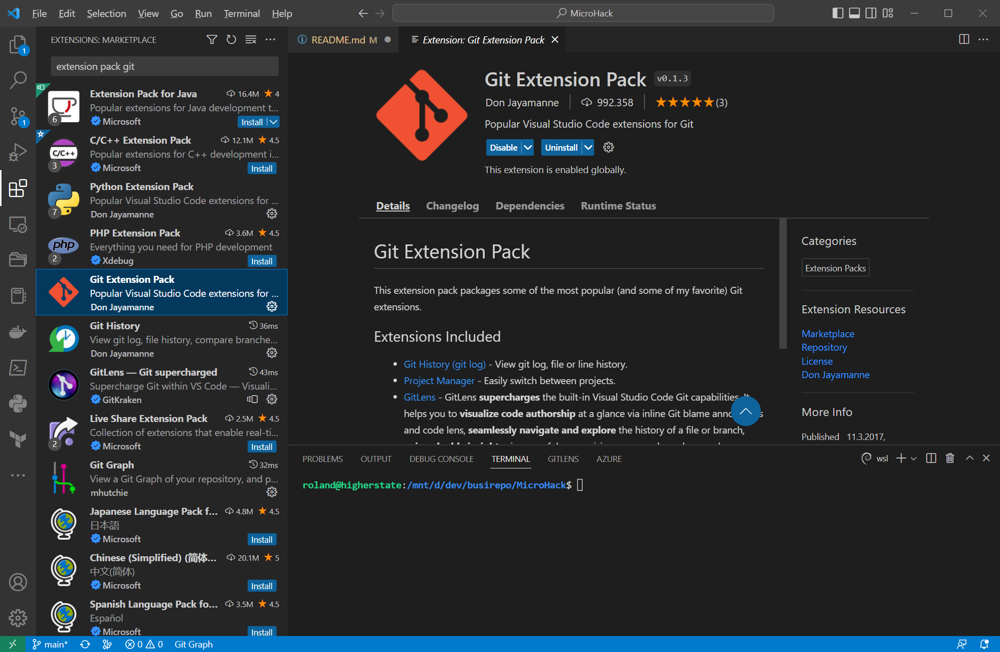
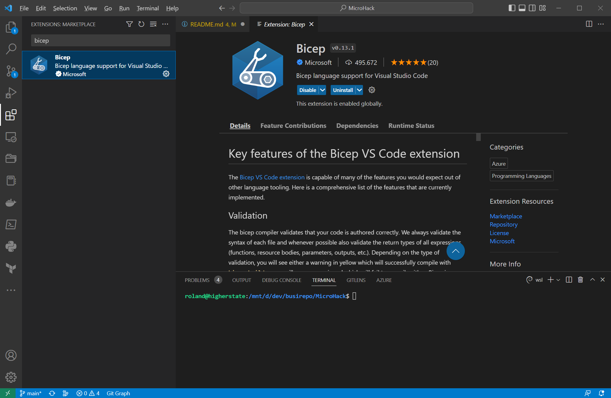

# **01 Build your modern web application**

- **Challenge 1: Prepare your development environment**
    In this challenge we prepare the development environment.

    In this challenge we use the Windows Subsystem for Linux together with VS Code.

    [How to setup this scenario](https://learn.microsoft.com/en-us/windows/wsl/install)

    [How to setup git](https://docs.github.com/en/get-started/quickstart/set-up-git)

    In VS Code install the git extension pack:

    

    Add the Bicep Extension to VS Code:

    

    
    
- **Challenge 2: Adding a Bicep deployment to the project**
In this challenge we add the Bicep deployment to the project.

- **Challenge 3: Create a React Web App**
To create a React Web App, run the following commands from the root folder of the project:

`npx create-react-app cloudastro-react-app`

The following output is shown:
