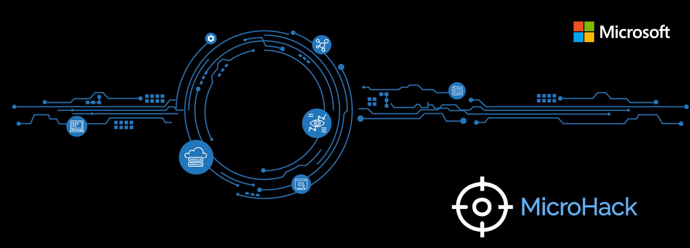

# **01 Build your modern web application - MicroHack**

## **Introduction**

This hack is designed to help you get hands-on experience with publishing a modern web application to Microsoft Azure in three different ways:

- as an Azure Static Web App
- as an App Service
- as a containerized installation

## **Learning Objectives**

In this hack you will learn how to use Bicep to deploy infrastructure to Azure, how to build a CI/CD pipeline in GitHub to deploy the web app, and get an overview of the differnt ways of hosting the web app in Azure.
This lab is not a full explanation of preparing a development workstation, please consider the following articles required pre-reading to build foundational knowledge.

[Setup Node on Windows](https://nodejs.org/en/download/)

[Setup VS Code](https://code.visualstudio.com/Docs/setup/setup-overview)

[How to setup git](https://docs.github.com/en/get-started/quickstart/set-up-git)

## **Content and challenges**

- [Getting started](./Challenges/00-Pre-Reqs.md)
- [Challenge 1: Deploy the lab environment](./Challenges/01-Deploy-the-lab-environment.md)
- [Challenge 2: Adding a bicep deployment](./Challenges/02-Adding-a-bicep-deployment.md)
- [Challenge 3: Create a React Web App](./Challenges/03-Create-a-react-web-app.md)
- [Challenge 4: Setup GitHub Actions](./Challenges/04-Setup-github-actions.md)
- [Challenge 5: Deploy as Static Web App](./Challenges/05-Deploy-as-static-web-app.md)
- [Challenge 6: Deploy as App Service](./Challenges/06-Deploy-as-app-service.md)
- [Challenge 7: Deploy as Containerized Application](./Challenges/07-Deploy-as-containerized-application.md)
- [Challenge 8: Set up basic monitoring with Azure Monitor](./Challenges/08-Setup-basic-monitoring-with-azure-monitor.md)

## **Prerequisites**

- Azure Subscription
- VS Code installed on the local PC
- Node for Windows installed
- Visual Studio Biceps Extension installed
- Azure CLI
- Docker Hub account

Permissions for the deployment:

- Contributor on your Azure Subscription

## **Solution Guide**

- [Solution 1: Deploy the lab environment](./SolutionGuide/01-Deploy-the-lab-environment-solution.md)
- [Solution 2: Adding a bicep deployment](./SolutionGuide/02-Adding-a-bicep-deployment-solution.md)
- [Solution 3: Create a React Web App](./SolutionGuide/03-Create-a-react-web-app-solution.md)
- [Solution 4: Setup GitHub Actions](./SolutionGuide/04-Setup-github-actions-solution.md)
- [Solution 5: Deploy as Static Web App](./SolutionGuide/05-Deploy-as-static-web-app-solution.md)
- [Solution 6: Deploy as App Service](./SolutionGuide/06-Deploy-as-app-service-solution.md)
- [Solution 7: Deploy as Containerized Application](./SolutionGuide/07-Deploy-as-containerized-application-solution.md)
- [Solution 8: Set up basic monitoring with Azure Monitor](./SolutionGuide/08-Setup-basic-monitoring-with-azure-monitor-solution.md)

## **Contributor**

- Roland Meier
- Dren Gjini
