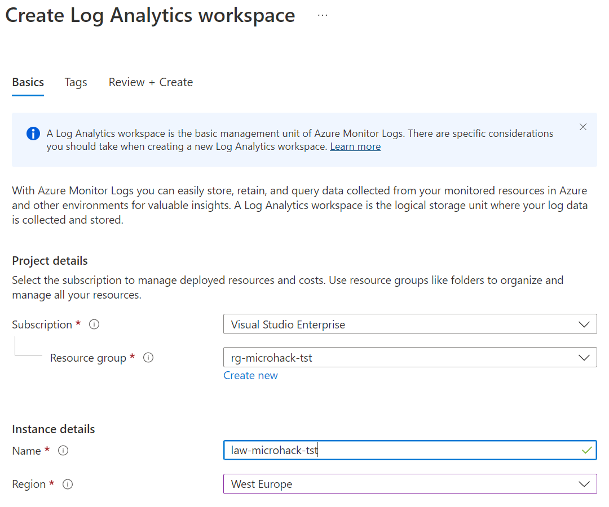

# Solution 1 - Deploy the lab environment

Duration: xx-xx min

## Task 1: Create a Resource Group

In the Azure Portal select 'Create a Resource' and type 'resource group'. Select Resource Group from Marketplace and select 'Create'.

### Task 2: Create a Log Analytics Workspace

In the Azure Portal select the new Resource Group and select 'Create' in the upper left corner. Type 'Log Analytics' and select 'Log Analytics Workspace' from MArketplace. Select 'Create' and fill out the form like in the following example given.

### Task 3: Create an Application Insights Workspace

In the Azure Portal select the new Resource Group and select 'Create' in the upper left corner. Type 'Application Insights' and select 'Application Insights' from Marketplace. Select 'Create' and fill out the form like in the following example given.

[Challenge 2](../Challenges/02-Create-a-react-web-app.md) - [Home](./../README.md)