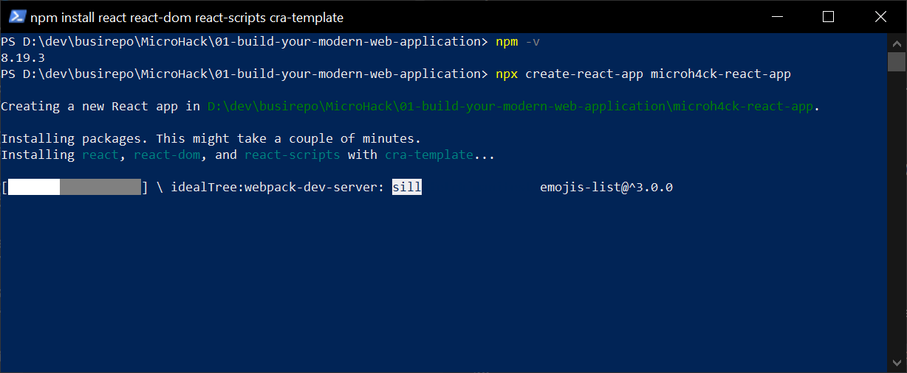

# Solution 2 - Create a React web app

Duration: xx-xx min

### Task 1: Open PowerShell and Check npm

Open a PowerShell terminal, change to the solution folder and type:

`npm -v`
  

The output should show the version of npm.

### Task 1: Create a React Web App

To create a React Web App you can use the node module `create-react-app`.

Type `npx create-react-app microhack-react-app`

After the module has finished creating the React App, change into the React App folder and type:

`npm start`

This should open your browser and show the React App starting page.

Note: In this scenario it is not necessary to build with `npm run build` since this is done within the CI/CD workflow on every commit.

### Task 3: Task 3 Delete unneccesary files from solution folder

From the React App folder in PowerShell type `Remove-Item -Recurse -Force .\node_modules\`.

Now we are ready to deploy this React Web App to Microsoft Azure.

[Back to top](#solution-2---create-a-react-web-app)

[Challenge 3](../Challenges/03-Deploy-as-static-web-app.md) - [Home](./../README.md)
