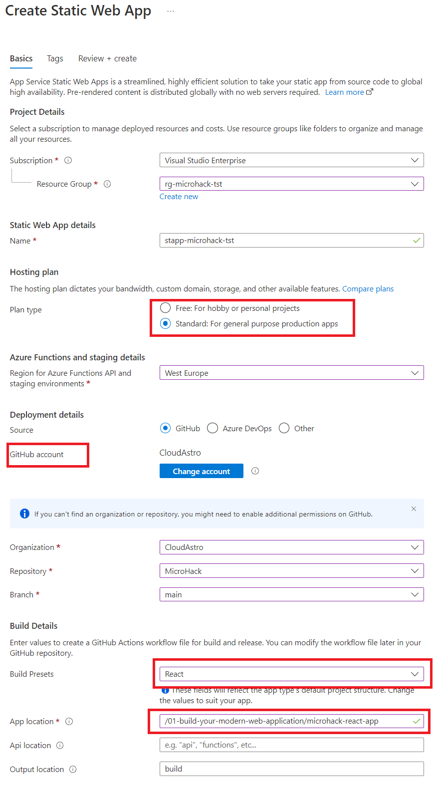
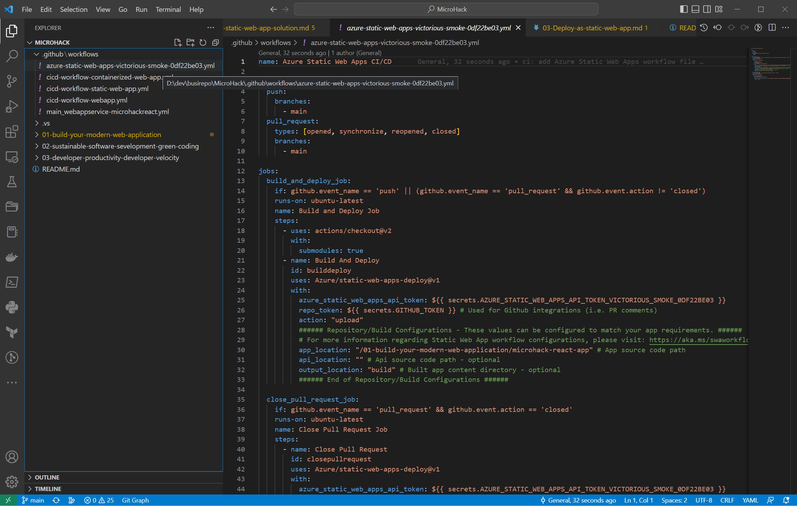
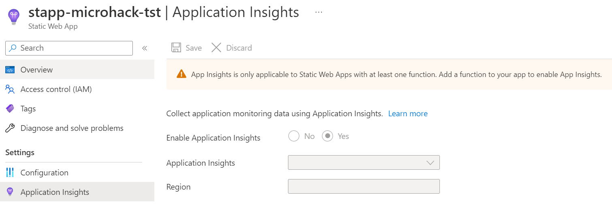

# Solution 3 - Deploy as static web app

Duration: xx-xx min

### Task 1: Create a Static Web App

1. Open the Azure Portal and browse to the Resource Group created in Challenge 1.

2. Select 'Create' to add a new resource.

3. Type `Static Web App` and select Web App from the Marketplace.

4. Fill out the form according to the pictures

### Task 1: Review the CI/CD workflow

In VS Code sync the repository.

Go to .github\workflows in the Explorer tree and check if there is a new workflow.

This workflow was created from Azure Web App creation wizard and can be used for a CI/CD workflow.

### Task 3: Review the created Static Web App

Browse to the resource of the Static Web App and select Application Insights on the left pane.
Note the warning message:

`App Insights is only applicable to Static Web Apps with at least one function. Add a function to your app to enable App Insights.`

Because our React App does not offer an API, we cannot monitor the Static Web App with Application Insights.

[Challenge 4](../Challenges/04-Deploy-as-app-service.md) - [Home](./../README.md)