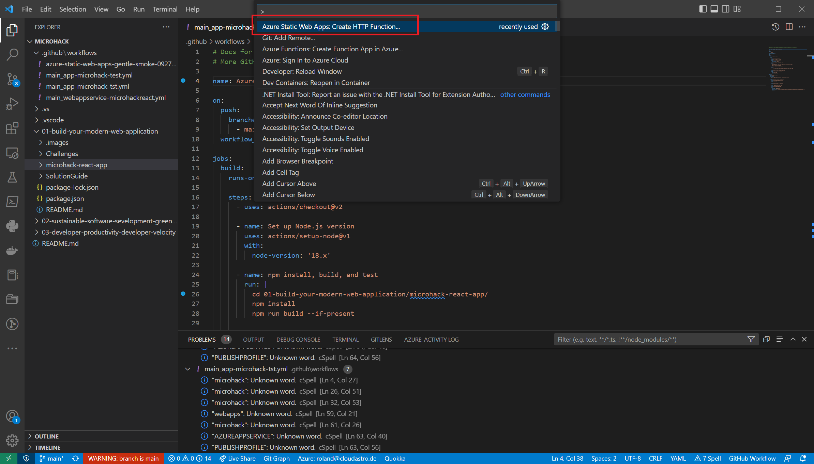

# Solution 3 - Deploy as static web app

Duration: xx-xx min

### Task 1: Create a Static Web App

1. Open the Azure Portal and browse to the Resource Group created in Challenge 1.

2. Select 'Create' to add a new resource.

3. Type `Static Web App` and select Web App from the Marketplace.

4. Fill out the form according to the pictures

### Task 1: Review the CI/CD workflow

In VS Code sync the repository.

Go to .github\workflows in the Explorer tree and check if there is a new workflow.

This workflow was created from Azure Web App creation wizard and can be used for a CI/CD workflow.

### Task 3: Review the created Static Web App

Browse to the resource of the Static Web App and select Application Insights on the left pane.
Note the warning message:

`App Insights is only applicable to Static Web Apps with at least one function. Add a function to your app to enable App Insights.`

Because our React App does not offer an API, we cannot monitor the Static Web App with Application Insights.

### Task 4: Add an API

To integrate an API in the Static Web App use VS Code. Select `Azure Static Web Apps: Create Http Function` from the command palette.
Set a Http Trigger and select Java Script as language.

When finished, move the newly created api folder to the folder `01-build-your-modern-web-application`

Use this folder in the new Static Web App as API location:

To call the API we have to change some code:

To test this behavior we can integrate the API to the Web Frontend by using the Azure Static Web Apps Cli. First we ensure that node is available and the swa cli is installed:

Change into the folder of the React App: `cd ./microhack-react-app/`
Then type the following commands:

`npm install`
`npm run build`
`npm install -g @azure/static-web-apps-cli` (if not already done in Pre-Requisites)

Then we can integrate the Web Frontend and the API Function by typing:

`swa start build --api-location ../api`

In the PowerShell window, the URL is displayed how to call the API. In my case it is localhost port 7071:

`http://localhost:7071/api/HttpTrigger1?name=MicroHacker`

This displays the message:

`Hello, MicroHacker. This HTTP triggered function executed successfully.`

With Ctrl - C stop the local serve and sync the changes to the repository. Test the newly distributed web page in Azure by calling the API.

When the API works, move on to the next Challenge.

### Task 5: Review Static Web App

Review the monitoring capabilities with the new Static Web App containing an API location.

Select `Open in Application Insights` to view logging details of the Static Web App.

[Challenge 4](../Challenges/04-Deploy-as-app-service.md) - [Home](./../README.md)
