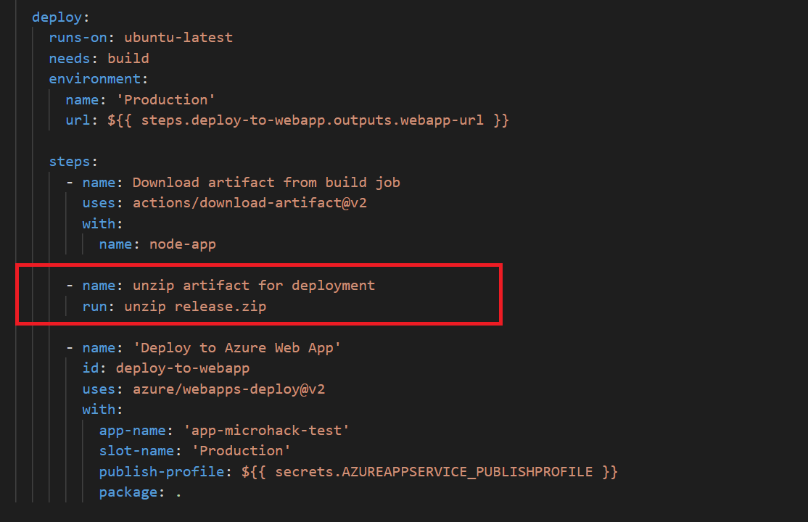

# Solution 4 - Deploy as App Service

Duration: xx-xx min

### Task 1: Create a Web App

In the Azure Portal go to the Resource Group created and select 'Create'.

Type `Web App` and select Web App from the Marketplace.

Fill out the form according to the picture below:

After the deployment is complete a new App Service Plan is created together with the Web App. The Web App is integrated to the GitHub repository, a new workflow is created for a CI/CD scenario. Application Insights is configured for monitoring.

### Task 2: Change workflow for Web App

To deploy a React App succeessfully, we give the workflow some improvements:

1. Zip Deploy

2. Path corrections

Add the following lines to the workflow:

And below add the following lines:

When the deployment is done, we need a startup command to be added to the Web App:

`pm2 serve /home/site/wwwroot/build --spa --no-daemon`

### Task 3: Review created Web App

In the Azure Portal select the Web App instance and browse to Application Insights.

Select `View Application Insights data`

Select `Application Dashboard`

[Challenge 5](../Challenges/05-Deploy-as-containerized-application.md) - [Home](./../README.md)