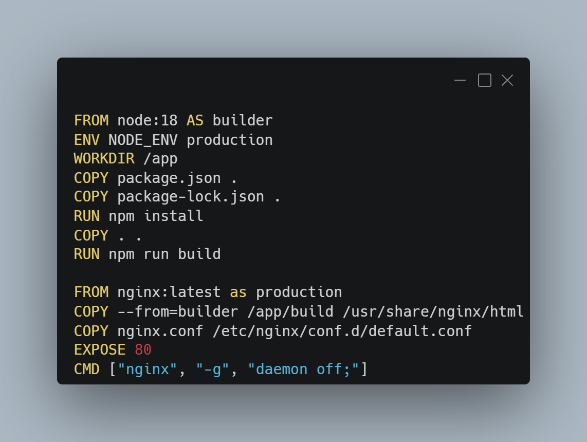
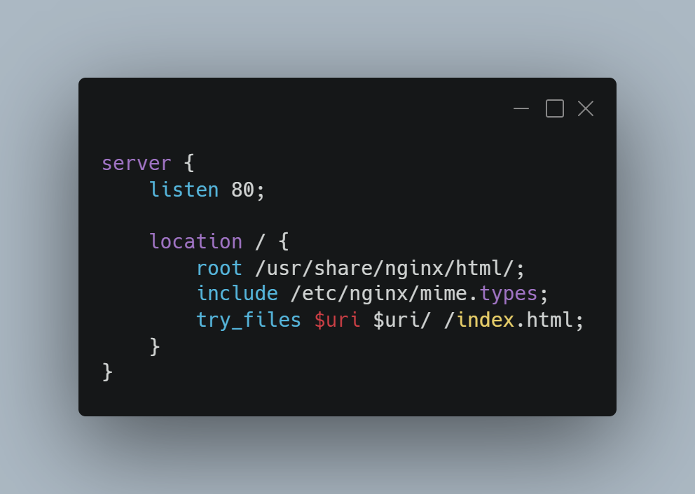
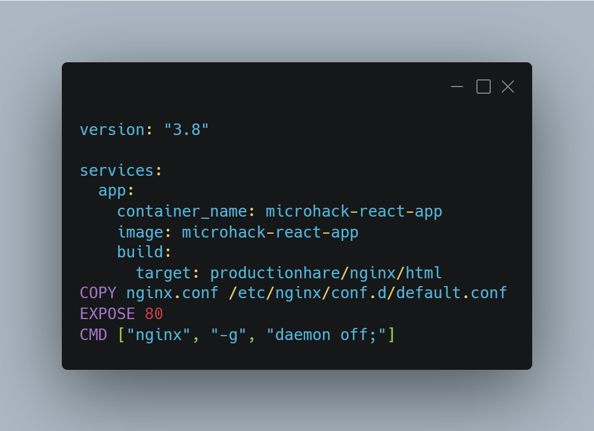
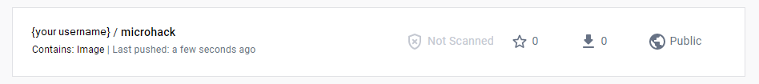
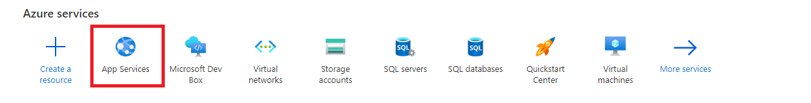
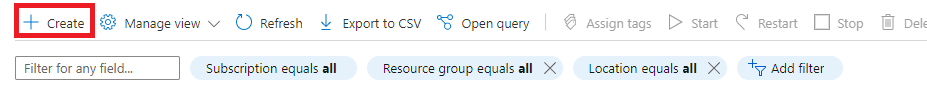
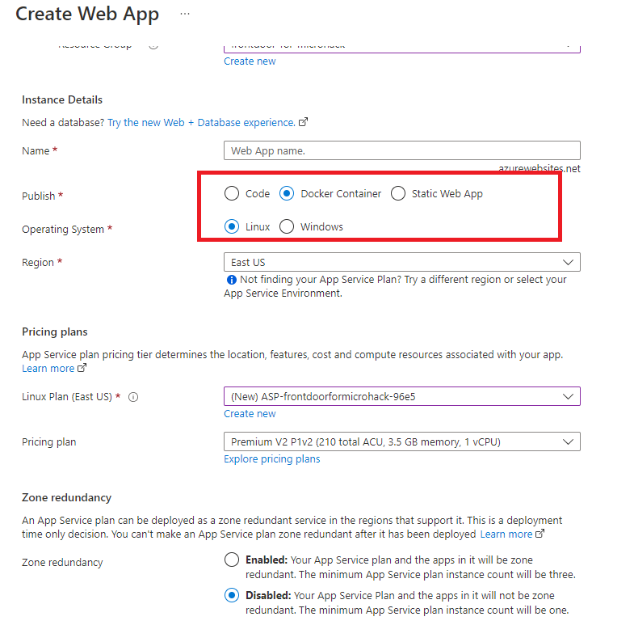
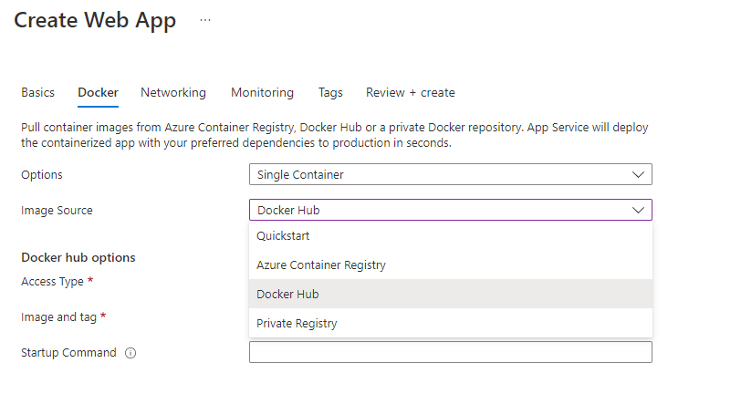
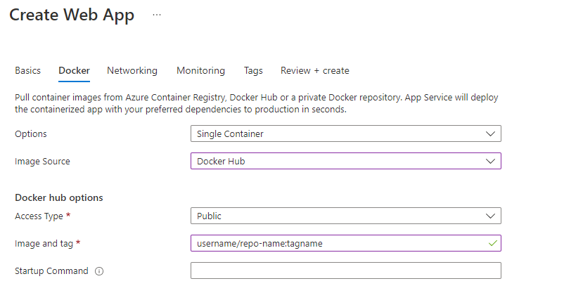
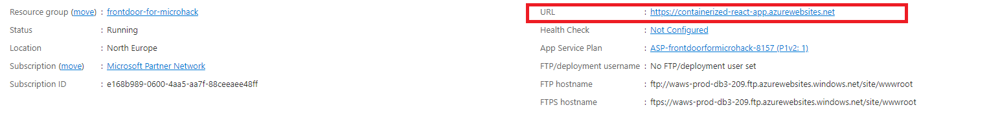

# Solution 5 - Deploy as Containerized Application

Duration: 35-45 min

### Task 1: Create a docker image of your react app

Open Docker Desktop (if Windows or MAC). If not installed on your machine, [get here](https://www.docker.com/products/docker-desktop/).

Open your React App using your favorite code editor or IDE.

In the root directory of the project create a new file and name it `Dockerfile`.

Then write the follwing code into the dockerfile
**note!** chose your node version (for this microhack we used version 18)

Next you will need to create a Nginx config file and write the configuration like the image below, name it `nginx.conf`.

After you are done withe the Nginx configuration, now you need docker compose. Create a docker compose yaml file, name it `docker-compose.yml` and
define the docker image (see image below).

After you are done with the previous steps, now open the terminal and build your image with the `docker-compose build` command.

Then alternatively you can test your image by running it localy using `docker run -p 80:80 --name microhack-react-app microhack-react-app` in your terminal.
Open your browser, the app should be running in `localhost`.

If everything is working lets proceed to the next task

### Task 1: Push image on Docker Hub

You can push your docker image to dockerhub through the Docker Desktop app or [Docker Hub Web](https://hub.docker.com/)

After you have pushed your docker image go to Docker Hub you should see the image already in your repository

### Task 3: Create a new Azure App Service and deploy

In Microsoft Azure go to App Services 

Create a new App Service 

In teh Basics Tab, it is important you pick the Docker Container option in the "Publish" Field

Then navigate to the Docker tab, in the Options field select "Single Container", and Image Source should be "Docker Hub"

Now provide the Docker image and tag (can be found in your docker hub account). Then Press the "Review and Deploy" Button.

After a few seconds or minutes the containerized React App is deployed and under "Overview" you should have a look like this

Click the Link provided to you and the App should open.

