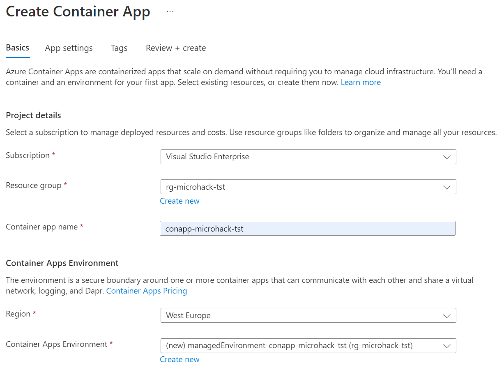
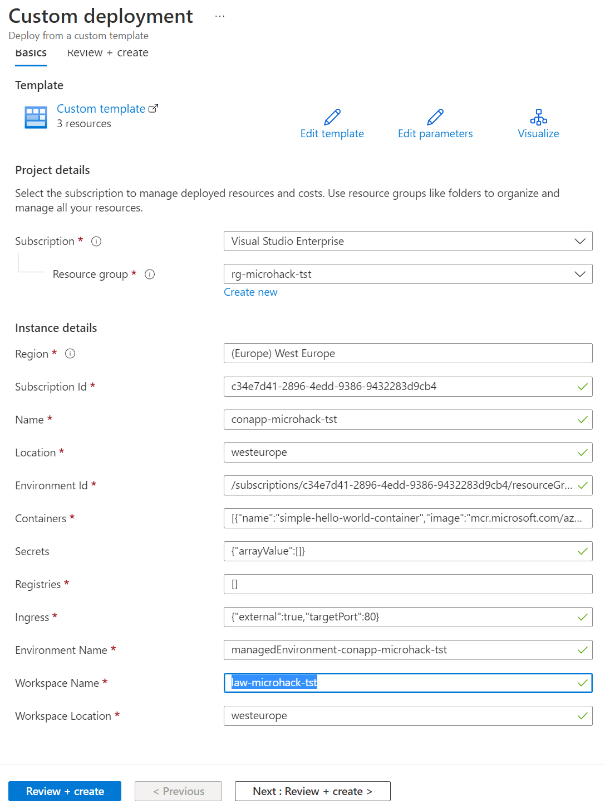
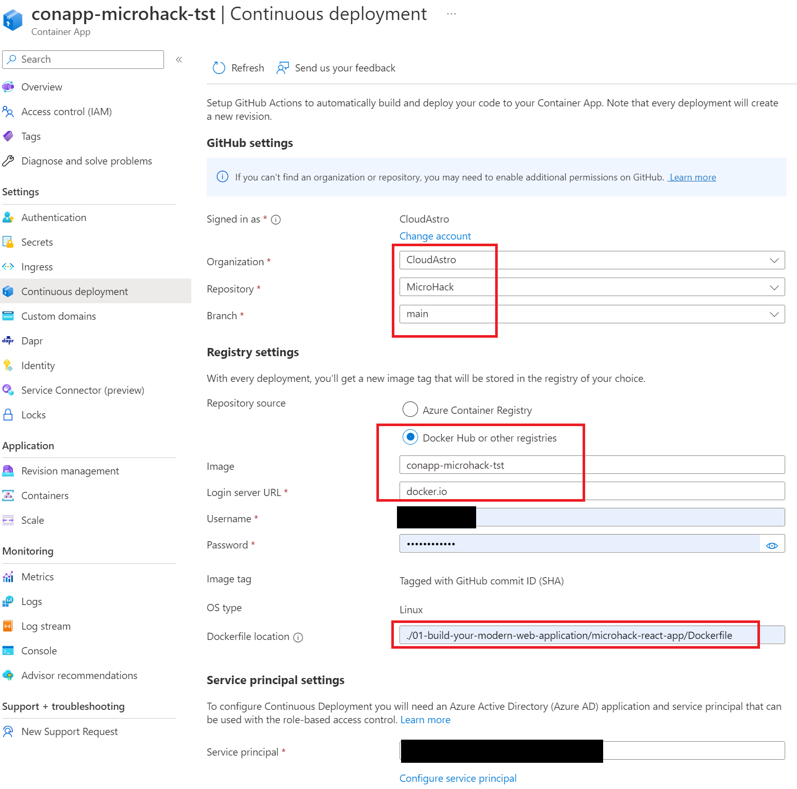

# Solution 5 - Deploy as Containerized Application

Duration: 35-45 min

### Task 1: Create a docker image of your react app

Open Docker Desktop (if Windows or MAC). If not installed on your machine, [get here](https://www.docker.com/products/docker-desktop/).

Open your React App using your favorite code editor or IDE.

In the root directory of the project create a new file and name it `Dockerfile`.

Then write the follwing code into the dockerfile
**note!** chose your node version (for this hack we used version 18)

Next you will need to create a Nginx config file and write the configuration like the image below, name it `nginx.conf`.

After you are done withe the Nginx configuration, now you need docker compose. Create a docker compose yaml file, name it `docker-compose.yml` and
define the docker image (see image below).

After you are done with the previous steps, now open the terminal and build your image with the `docker-compose build` command.

Then alternatively you can test your image by running it localy using `docker run -p 80:80 --name microhack-react-app microhack-react-app` in your terminal.
Open your browser, the app should be running in `localhost`.

If everything is working lets proceed to the next task

### Task 2: Create a docker registry

To deploy a Container App, we need a registry from where the image can be deployed. You do not have to push an image to the registry, it is done automatically during setup of the Container App.

Options are:

- Azure Container Registry
- Docker Hub

[Docker Hub Web](https://hub.docker.com/)

Create a Docker Hub account.
Hold your Docker Hub login available.

### Task 3: Create a new Container App

In Microsoft Azure go to the Resource Group created in the first Challenge.

Select `Create` from the upper left corner and type `Container`, select Container App from the Marketplace.

Configure the Container App according to the following pictures.

Create a new Container Apps Environment like this:

Choose the example given as deployment option to have a Hello World Container App with HTTP Ingress configured to port 80.

Review and create the Container App. In this step, three resources are created:

- Container App
- Container App Environment
- Log Analytics Workspace with random id

It is not possible to choose an existing Log Analytics Workspace from the portal at this time, so we need to redeploy the template with the Log Analytics Workspace created in Challenge 1.

### Task 4: Configure the Container App

1. In the Azure Portal (PWA) browse to the Resource Group created in Challenge 1.
2. In the left navigation pane select Deployments and select the last deployment of the Container App.
3. In the top pane select `Redeploy`.
  Change the variable name `workspoace name` to `law-microhack-tst` and select `Review and Create`.

  

  This is redeploying the settings and now we are using the correct Log Analytics Workspace.
4. Delete the additional Log Analytics Workspace with the random name.
5. Browse to the Container App and in the left navigation pane select `Continuous deployment`.

6. Configure the settings according to the picture below, please enter here your docker account name and password:

The service principal needs to be configured. In our example we use an already created service principal for deployments in this subscription, but you can select `create new` to create the service principal for Azure Deployments automatically.

From below select `Start continuous deployment`.

In the left navigation pane select `Ingress`.

The settings should provide port 80 for HTTP traffic.

Select `Overview` and select the Application Url top right in this window.

When the deployment has finished, the React App should open.

[Challenge 6](../Challenges/06-Setup-basic-monitoring-with-azure-monitor.md) - [Home](./../README.md)
