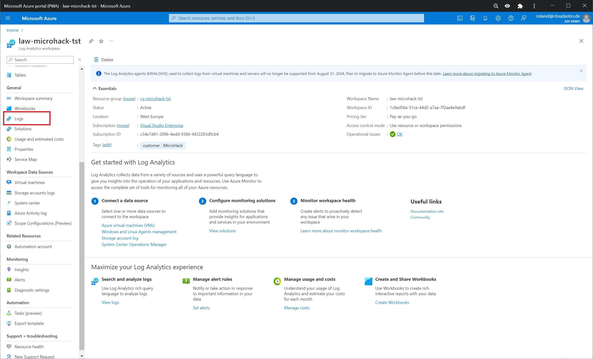
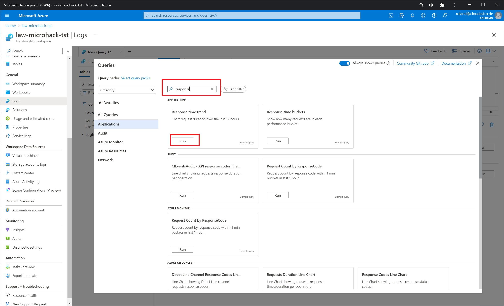
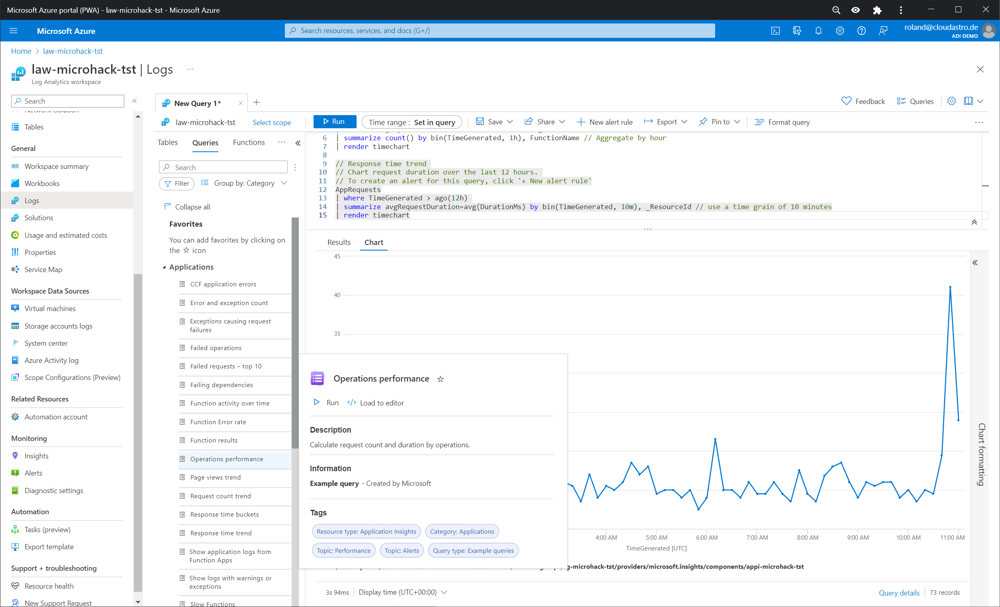
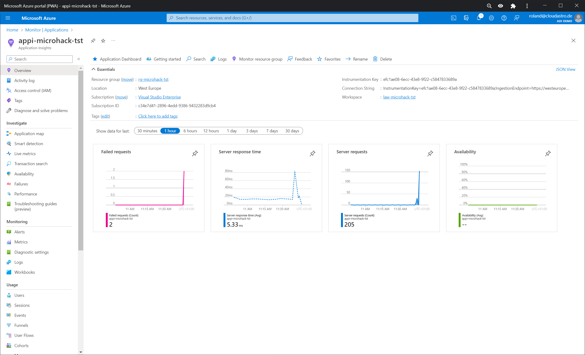
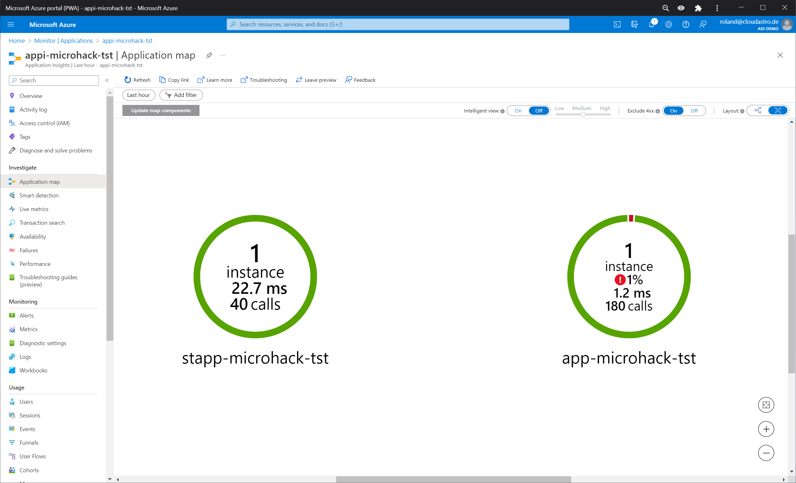
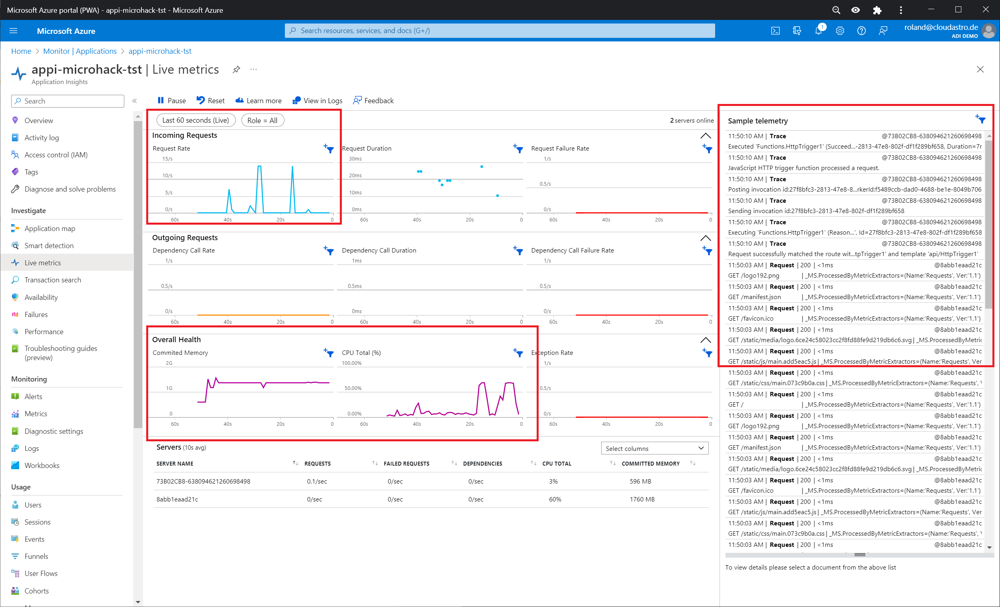
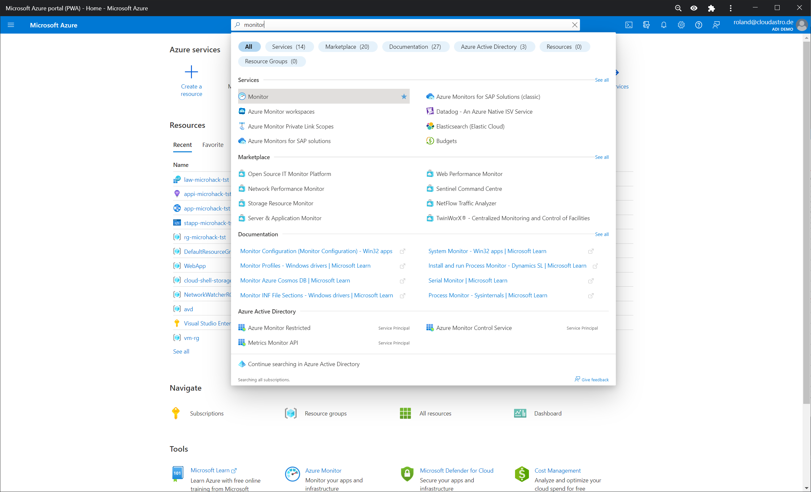
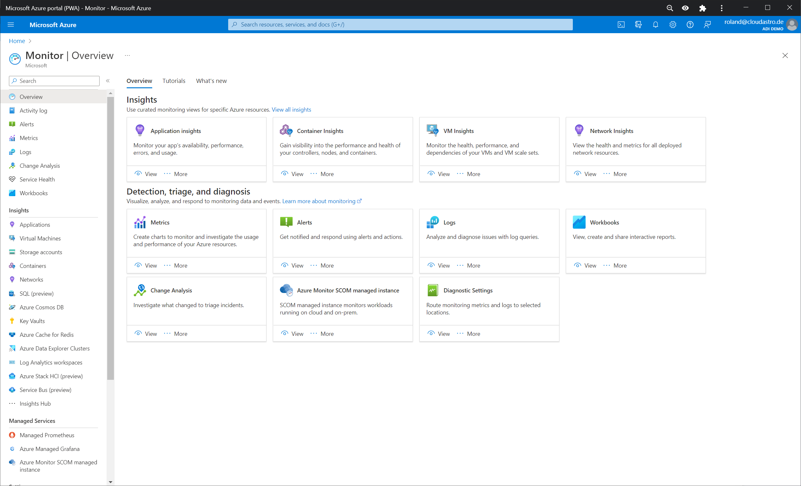
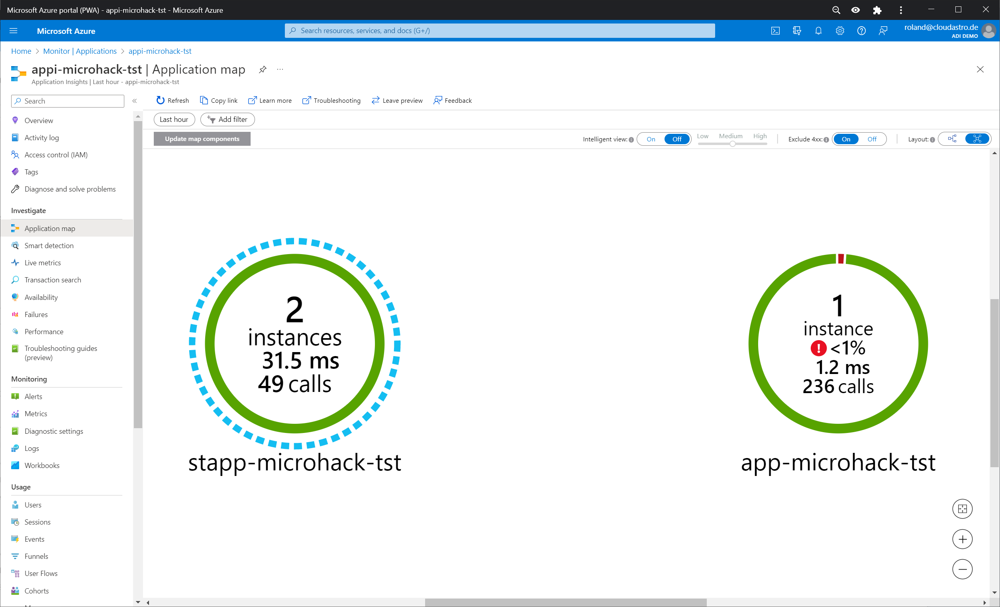

# Solution 6 - Setup basic monitoring with Azure Monitor

Duration: 15-30 min

### Task 1: Review the Log Analytics Workspace

In the Azure portal please review the Log Analytics workspace created in Challenge 1. See the different logs created for the services in this hack.

In the left navigation bar select Logs:

In the pop-up window type `response` and select `response time trend`.

Click `Run`

### Task 2: Review Application Insights

In the Azure portal please review the Application Insights workspace created in Challenge 1. See the different analysis options and reports for the services in this hack.

In in the Azure portal select Application Insights.

In the left navigation pane select Application Map:

Navigate to Live Metrics and pay attention to the right pane while you make http get requests to either application. To do so open the browser and enter the following URL's:

For the Static Web Application your URL might vary due to automatically naming of the instance:

`https://gentle-smoke-09270ea03.2.azurestaticapps.net`

and:

`https://gentle-smoke-09270ea03.2.azurestaticapps.net/api/HttpTrigger1?name=MicroHacker`

For the Web App type the following URL:
`https://app-microhack-tst.azurewebsites.net/`

When playing around with the requests given, please recognize in the Live Tracker that only API requests are monitored for the Static Web App.

### Task 3: Use Azure Monitor

In Azure portal use the Search line and type `Monitor`. Select Monitor from the list. See the points connected in Azure Monitor. On the left navigation pane all types of logging from your Azure Infrastructure are visible.

Select Applications in the left navigation pane:
As you see, the Application Insights workspace is connected.

In Application Insights go to the application map and see the updated requests and instances.

[Home](./../README.md)