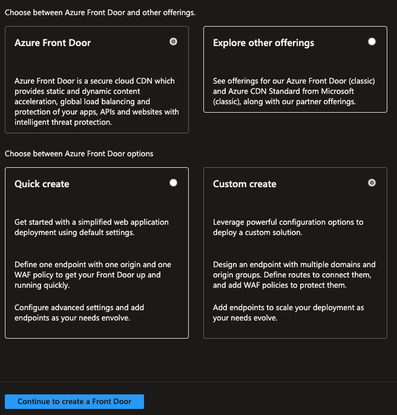
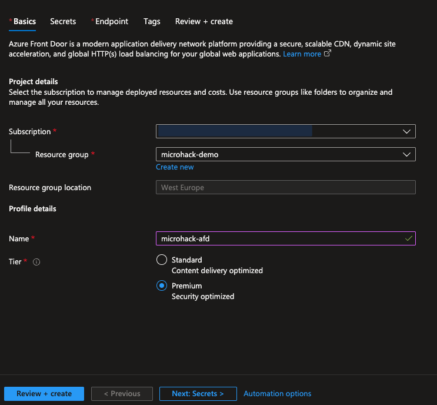
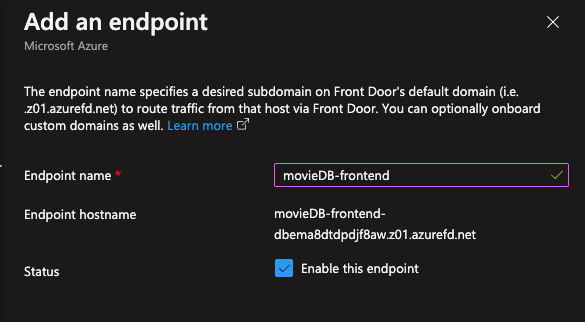
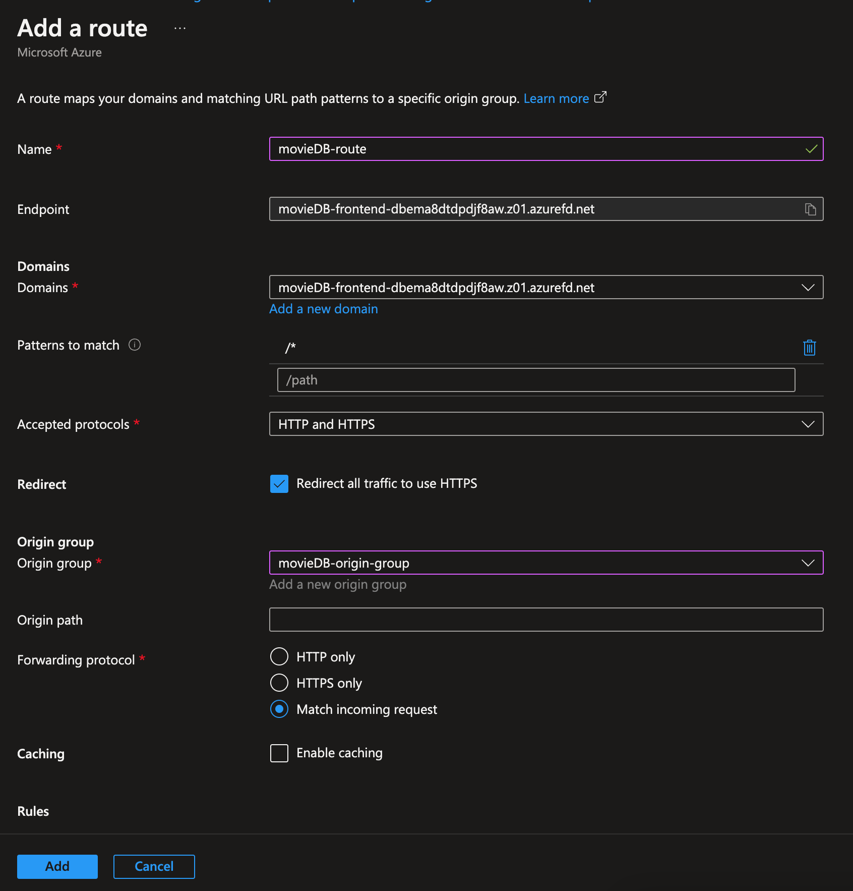
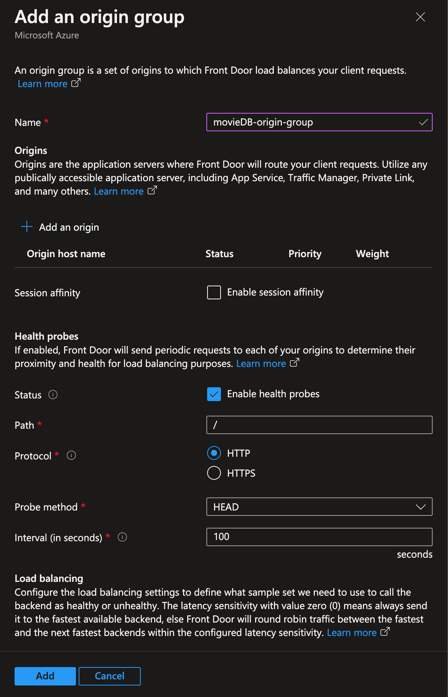
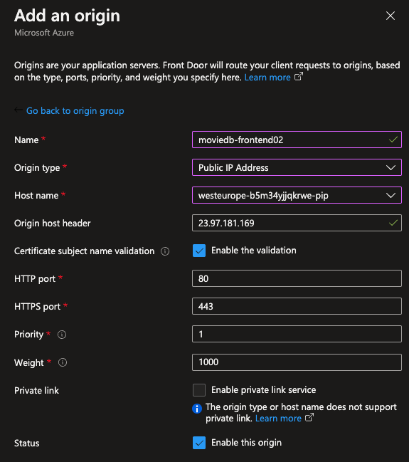

# Challenge 1: Multi-regional deployment for fast region switches

**[Home](../README.md)** - [Next Challenge Solution](./02-Deploy-Low-Carbon-Region.md)

## Task 1: Create an automated deployment for the virtual machines

For this example we're using Azure Bicep to take of the deployment of of the virtual machines. You can find the full code example in the bicep folder.

Virtual machines can be bootstrapped in many ways. In our case we decided to use cloud-config. Cloud config enabled to to fully customize the virtual machine at deployment time.

Below you find a cloud-config that is setting up Docker and pulls the container from the ACR. Be aware of the placeholders that need to filled
```
#cloud-config

users:
- default
package_update: true
package_upgrade: true

groups:
- docker

system_info:
  default_user:
    groups: [docker]

packages:
- apt-transport-https
- ca-certificates
- curl
- gnupg
- lsb-release
- unattended-upgrades
write_files:
runcmd:
- mkdir -p /etc/apt/keyrings
- curl -fsSL https://download.docker.com/linux/ubuntu/gpg | gpg --dearmor -o /etc/apt/keyrings/docker.gpg
- echo "deb [arch=$(dpkg --print-architecture) signed-by=/etc/apt/keyrings/docker.gpg] https://download.docker.com/linux/ubuntu $(lsb_release -cs) stable" | tee /etc/apt/sources.list.d/docker.list > /dev/null
- apt-get update -y
- apt-get install -y docker-ce docker-ce-cli containerd.io
- systemctl enable docker
- systemctl start docker
- docker login ${acrName}.azurecr.io -u ${acrName} -p ${acrPassword}
- docker pull ${acrName}.azurecr.io/${containerName}
- docker run -d -p 80:3000 --restart=always ${acrName}.azurecr.io/${containerName} -e DATABASE_URL='${cosmosEndpoint}''
```

## Task 2: Creating a Cosmos DB and database

To create a Cosmos DB there are multiple options like the Azure portal or the Azure CLI. To do it with the CLI use the following code:

```
az cosmosdb create `
  --resource-group $RESOURCE_GROUP `
  --name $COSMOSDB_NAME `
  --kind MongoDB `
  --locations regionName=westeurope failoverPriority=0 `
  --locations regionName=northeurope failoverPriority=1 `
  --enable-multiple-write-locations
```
After the Cosmos DB is created we need to create a dedicated MongoDB database

az cosmosdb mongodb database create `
  --account-name $COSMOSDB_NAME
  --name test

The creation of these resources is also part of the bicep deployment

## Task 3: Create a Github action that deploys the environment to Azure

We begin by creating an Azure Service Principal which will be used by the GitHub action to authenticate against the Azure Management API.

From the Azure CLI run the following code:
```
az ad sp create-for-rbac `
  --name "MicroHack" `
  --role "contributor" `
  --scopes "/subscriptions/$SUBSCRIPTION_ID/resourceGroups/$RESOURCE_GROUP" `
  --sdk-auth
```
For $SUBSCRIPTION_ID and $RESOURCE_GROUP use your applicable values.
Copy the returned JSON output for the next step.

To create a Service Principal you require the owner role over the azure subscription you're working in. If you don't have that you won't be able to deploy automatically via GitHub actions but the build pipeline would still work.

To be able to use Azure Credentials in GitHub Actions some secrets need to be created first. In GitHub go to your repository and select "Settings", then "Secrets and variables" and then "Actions". Create a "New Repository Secret".
Name it for example "AZURE_CREDENTIALS" and paste the copied JSON.

Create a new folder in you project root called ".github/workflows". Then create a .yaml file for the GitHub Action:

```
name: Deploy to Azure

on:
  push:
    branches:
      - main

env:
  RESOURCE_GROUP: microhack-demo-rg
  ACR_NAME: acr12300
  CONTAINER_NAME: todo-app:v1
  FIRST_REGION: northeurope
  SECOND_REGION: westeurope
  DeployVMS: true
  DeployCONTAINERAPPS: false

jobs:
  deploy:
    runs-on: ubuntu-latest
    steps:
    - name: Checkout repository
      uses: actions/checkout@2541b1294d2704b0964813337f33b291d3f8596b

    - name: Login to Azure
      uses: azure/login@v1
      with:
        creds: ${{ secrets.AZURE_CREDENTIALS }}

    - name: Deploy Bicep template
      uses: azure/arm-deploy@v1
      id: deployment
      with:
        resourceGroupName: ${{ env.RESOURCE_GROUP }}
        template: ./bicep/main.bicep
        # Here we pass the template parameters to the deployment
        parameters: >
          firstRegion=${{ env.FIRST_REGION }} secondRegion=${{ env.SECOND_REGION }} acrName=${{ env.ACR_NAME }} containerName=${{ env.CONTAINER_NAME }} vmEnabled=${{ env.DeployVMS }} containerAppEnabled=${{ env.DeployCONTAINERAPPS }}
```

## Task 4: Setup Azure FrontDoor

A quickstart guide for setting up Azure Front Door with Azure Portal, CLI, PowerShell or Bicep for your App Service you can find here under the "Create a Front Door for your application" section.

1. Search for Front Door and CDN profiles and select Create in the Azure marketplace. Since we already have an application you can select Custom create and continue.



2. On the Basics tab enter the following information (or adjust them to your settings) and then select <b>Next:Secrets</b>. In the subscription field choose the subscription you also used to create the Microservices. Same goes for the resource group.



3. We can skip the secrets step for now but optionally if you have and existing Key Vault in azure that you plan to use to bring your own certificate for a custom domain, then add a certificate but you can also add one later after creation of the FrontDoor.

4. Go to <b>Next:Endpoint</b> and add an endpoint. You can give it a name you seem fit, it'll automatically create an endpoint hostname for you, then click "add".



5. Then select <b>Add a route</b> to configure routing to your Web App origin. On the Add a route page, enter the following information:



You will also need to create a new origin group like this:



Add two origins pointing to the public IPs of the created VMs earlier:



* <b>Name</b>: A name to identify the mapping between domains and origin group.
* <b>Domains</b>: A domain name will be autogenerated for you but you can add a custom domain by selecting <b>Add a new domain</b>.
* <b>Patterns to match</b>: Set the URLs this route will accept. The default is all URL paths.
* <b>Accepted protocols</b>: Select the protocol the route will accept
* <b>Redirect</b>: Enable to redirect all HTTP traffic to HTTPS endpoint
* <b>Origin group</b>: Select <b>Add a new origin group</b>. Select a name and Add an origin. The origin host name is the FQDN of your frontend without "https://".
* <b>Forwarding protocol</b>: The protocol that will be forwarded to the origin group. Here we will match the incoming requests to origin.
* <b>Caching</b>: If you want to cache contetns closer to your users globally using Azure Front Door's edge POPs and the Microsoft network
* <b>Rules</b>: Once deployed you can configure Rules to apply to your route.

6. Select <b>+ Add a policy</b> to apply a Web Application Firewall (WAF) policy to your domain.
7. On the <b>Add security policy</b> page, give your policy a name then select your domain you want to associate it with. If you don't have a policy already just select <b>Create New</b> to create a new policy.
8. Lastly you can go on <b>Review + Create</b> and then <b>Create</b> to deploy the Azure Front Door profile.

When all steps are completed and the Azure Front Door profile is deployed you can access it and will find the endpoint hostname in the overview section. If you copy and past the URL into your browser you can now access the frontend through Azure Front Door endpoint.

## Task 5: Setup Azure FrontDoor

The application has been prepared with a special endpoint to import some default data to the database.
To import the data access the application via $HOST/items/create to create the demonstration entries in the database
