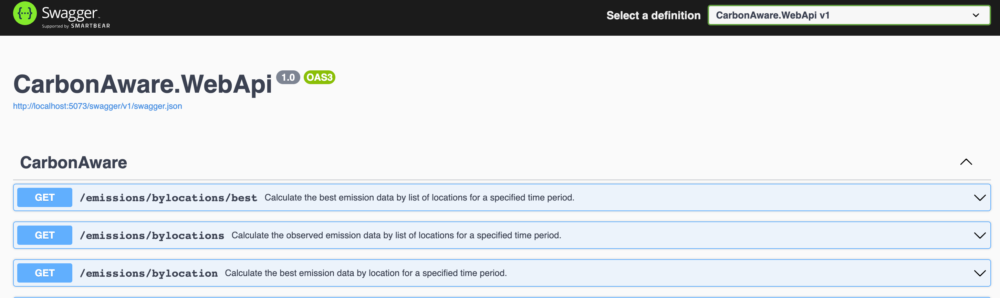
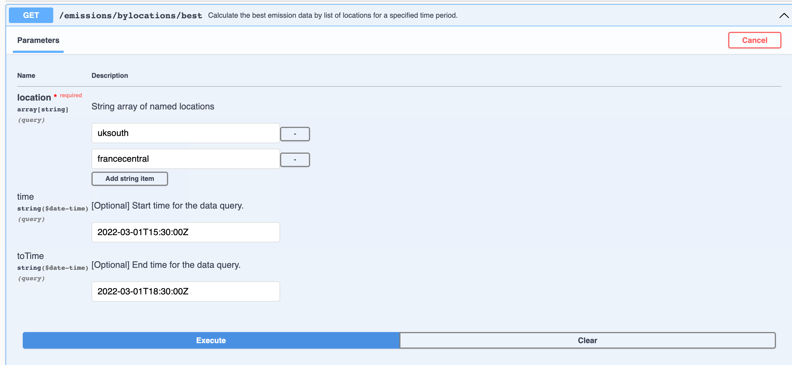
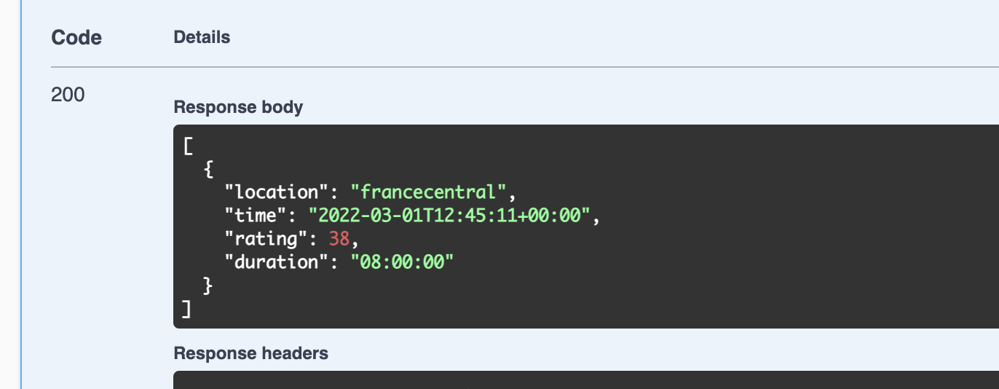

# Challenge 2: Deploy to low Carbon region

[Previous Challenge Solution](./01-Multi-Region-Deployment.md) - **[Home](../README.md)** - [Next Challenge Solution](./03-Improve-API-Efficiency-solution.md)

## Task 1: Use Carbon Aware SDK to determine low carbon region

To get started download the latest release of the Carbon Aware SDK from GitHub [Carbon Aware SDK] (https://github.com/Green-Software-Foundation/carbon-aware-sdk) and unpack the sources to an appropriate place on your computer.
Currently there are now pre-build binaries available so you need to build the application from the source.
This requires that you have the .Net 6.0 SDK installed.
```
git clone https://github.com/Green-Software-Foundation/carbon-aware-sdk.git
cd src/CarbonAware.WebApi/src/
dotnet run
```
Check for the URL in the logs and open the application in the browser. You will get a 404 error to fix that append /swagger to the URL and you should see the Swagger UI.



Open up the first entry and add uksouth, francecentral into the locations and click Execute


The result will show you the region with the least amount of carbon emission



## Task 2: Extend the Github action to deploy the application to a low carbon region

The Carbon Aware SDK is offering an GitHub action to integrate in our workflow we will check which region the SDK would suggest and then deploy a new virtual machine for that and add the region to the Cosmos DB replicated regions.

In the GitHub action we will take the Output form the Carbon Aware SDK step and set it as the second region in the bicep template deployment

```
name: Deploy to Azure Carbon Aware

on: [workflow_dispatch]

env:
  RESOURCE_GROUP: microhack-demo-rg
  ACR_NAME: acr12300
  CONTAINER_NAME: todo-app:v1
  FIRST_REGION: northeurope
  SECOND_REGION: westeurope

jobs:
  deploy:
    runs-on: ubuntu-latest
    steps:
    - name: Checkout repository
      uses: actions/checkout@main

    - name: CarboneAware metrics
      id: carboneaware-metrics
      uses: Green-Software-Foundation/carbon-aware-sdk@sdkCLI-githubaction
      with:
        location: francecentral, uksouth

    - name: Login to Azure
      uses: azure/login@v1
      with:
        creds: ${{ secrets.AZURE_CREDENTIALS }}

    - name: Deploy Bicep template
      uses: azure/arm-deploy@v1
      id: deployment
      with:
        resourceGroupName: ${{ env.RESOURCE_GROUP }}
        template: ./bicep/main.bicep
        # Here we pass the template parameters to the deployment
        parameters: >
          firstRegion=${{ env.FIRST_REGION }} secondRegion=${{ steps.carboneaware-metrics.outputs.LowestEmissionsLocation }} acrName=${{ env.ACR_NAME }} containerName=${{ env.CONTAINER_NAME }}
```
