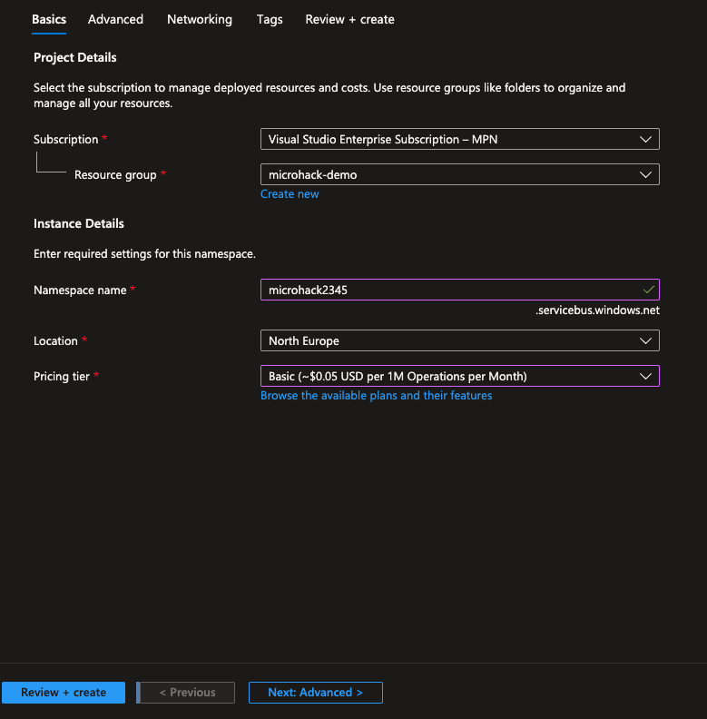
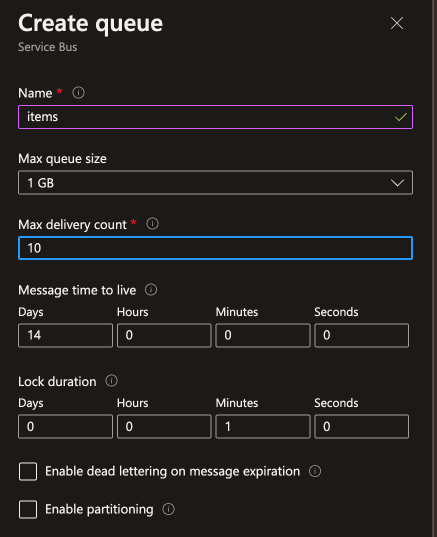
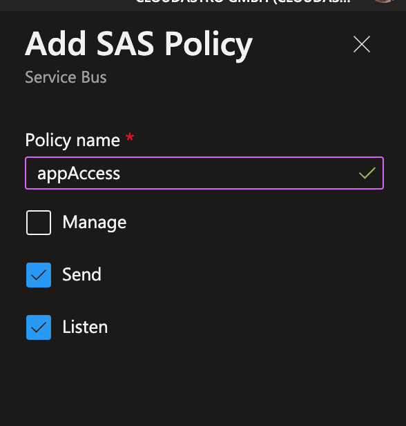

# Challenge 4: Optimize-for-async-access-patterns

[Previous Challenge Solution](./03-Improve-API-Efficiency-solution.md) - **[Home](../README.md)** - [Next Challenge Solution](./05-Move-to-PaaS-Services.md)

Duration: 50-60 Min

### Task 1: Configure Azure Service Bus

1. Search for Service Bus and select Create in the Azure marketplace. Give it a name, select a region and select a pricing tier in our case `Basic` is enough.

2. Create a new Queue

3. Go to Queues and select the just created queue. Next to go to `Shared access policies` to create an access key that you can use to authenticate against the Service Bus queue.

4. After the creation completed select the access policy and copy the Primary Connection string for later use.

### Task 2: Implement request-reply pattern using Azure Service Bus

Open the nestjs app and in your terminal on the root folder start by installing azure service bus `npm install @azure/service-bus`

In the `app.module` folder add the MessageQueue as a provider first so you can use it in ur app.

    @Module({
    imports: [other imports],
    controllers: [AppController],
    providers: [
    AppService,
    {
    provide: 'MessageQueue',
    useFactory: () => {
    const connectionString = 'Endpoint=sb://<your-service-bus>.servicebus.windows.net/;SharedAccessKeyName=<your-access-key-name>;SharedAccessKey=<your-access-key>';
    return new MessageQueue(connectionString);
    },
    },
    ],
    })
    export class AppModule {}

 

In this example, the ItemsService now uses the MessageQueueService to send and receive messages asynchronously using the request-reply pattern. The handleRequest method is added to handle incoming requests from the message queue. It checks the method field in the message payload and calls the appropriate methods in the service to handle the requests. You would need to implement the logic for handling each request method based on your application's requirements.

- Update your NestJS app's configuration with the Azure Service Bus connection string.

 

The emitEvent() method from the MessageQueueService is used to send events to the message queue, which can be consumed by other parts of your application or external services for further processing. The eventType and data properties in the event object can be customized to suit your specific use case. Note that the implementation details of emitting events may vary depending on the specific message queue service you are using. Please refer to the documentation of your chosen message queue service for more information on how to emit events. Also, make sure to update your message queue service to handle incoming events accordingly. This code assumes that you have already implemented the necessary infrastructure and configuration for using a message queue service in your application.

### Task 3: Implement event-driven pattern using Azure Service Bus

Make sure to replace 'item.created', 'item.updated', and 'item.deleted' with the actual event names that you are emitting in your movies service. Also, update the handling logic inside the event handler methods according to your application's requirements. The ItemCreatedEvent, ItemUpdatedEvent, and ItemDeletedEvent are custom event classes that you need to define based on your application's data model and event payload. Additionally, you'll need to configure your Azure Service Bus namespace and connection settings in your NestJS application's configuration or environment variables, and set up the appropriate connection and subscription to listen for events. The exact implementation may vary based on the Azure Service Bus library or package you are using in your application.

