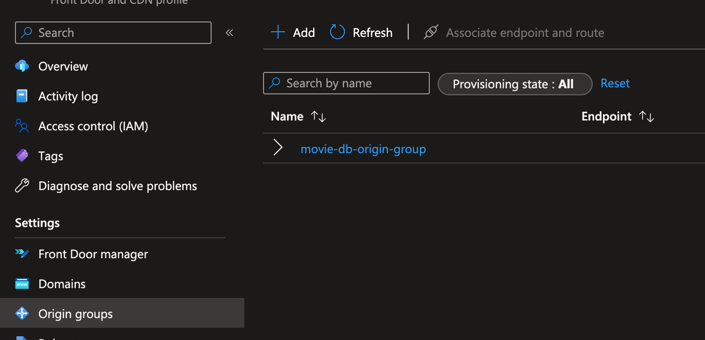
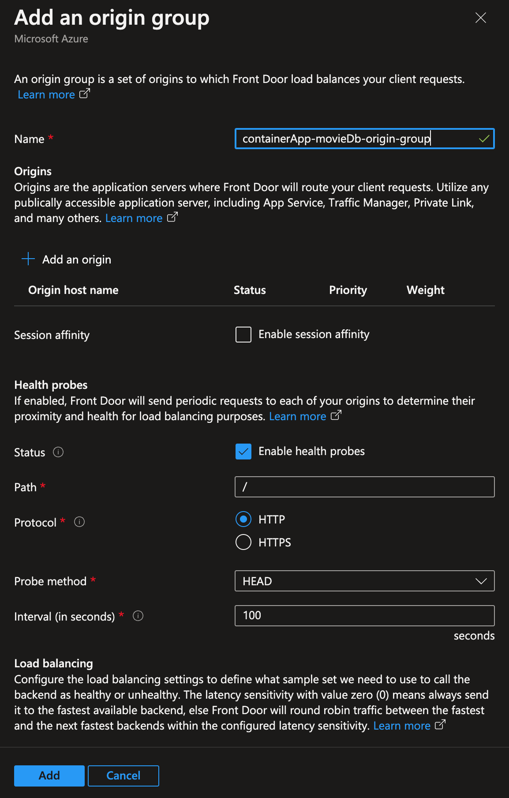
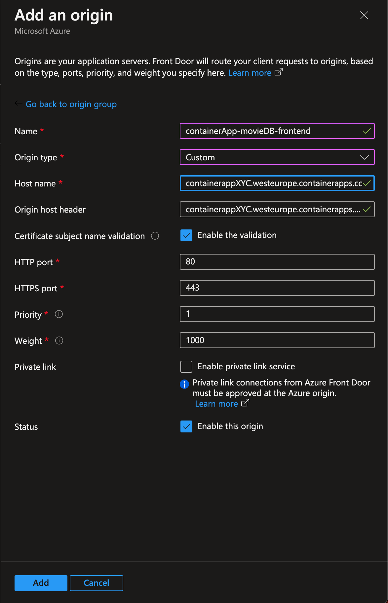
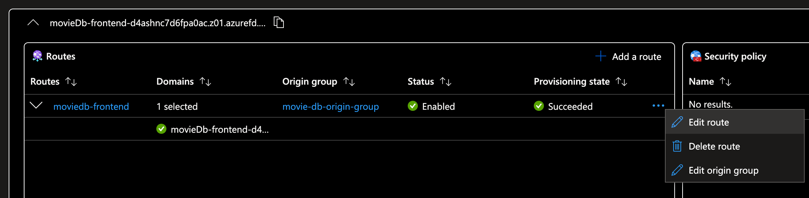
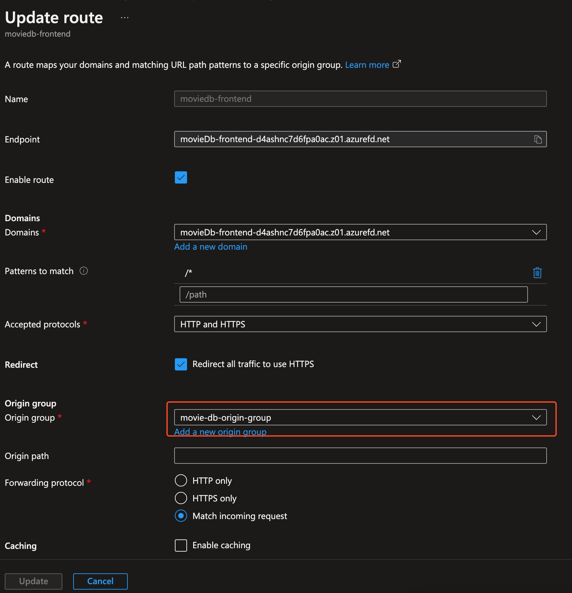

# Challenge 5: Move the application to a PaaS service

**[Home](../README.md)** - [Next Challenge Solution](./)

## Task 1: Adjust the Bicep and Github action to deploy the application to the Container Apps

You can create a container app with the Azure portal or with the Azure CLI. In our case we're going to adjust the Bicep code to deploy to the Container Apps.

You need to create two resources per region:
* Container Apps Environment

      A Container Apps environment is a secure boundary around groups of container apps that share the same virtual network and write logs to the same logging destination.
      Container Apps environments are fully managed where Azure handles OS upgrades, scale operations, failover procedures, and resource balancing.
* Container App

      Azure Container Apps manages the details of Kubernetes and container orchestration for you. Containers in Azure Container Apps can use any runtime, programming language, or development stack of your choice.

Below you'll find one way of deploying both container apps environment and a container app associated with the environment. Note that it can be enabled/disabled via a boolean parameter.

```
//-------------------------//
// Container Apps
//-------------------------//

resource containerAppEnvironment 'Microsoft.App/managedEnvironments@2022-10-01' = [for (location, i) in regions: if (containerAppEnabled) {
  name: '${uniqueString(resourceGroup().id)}-containerAppEnv-${i}'
  location: location
  properties: {
  }
}]

resource containerApp 'Microsoft.App/containerApps@2022-10-01' = [for (location, i) in regions: if (containerAppEnabled) {
  name: '${uniqueString(resourceGroup().id)}-containerApp-${i}'
  location: location
  properties: {
    managedEnvironmentId: containerAppEnvironment[i].id
    configuration: {
      secrets: [
        {
          name: 'containerregistrypasswordref'
          value: registry.listCredentials().passwords[0].value
        }
        {
          name: 'cosmosDbUrl'
          value: cosmosDbAccount.listConnectionStrings().connectionStrings[0].connectionString
        }
      ]
      ingress: {
        external: true
        targetPort: 80
      }
      registries: [
        {
          server: '${acrName}.azurecr.io'
          username: acrName
          passwordSecretRef: 'containerregistrypasswordref'
        }
      ]
    }
    template: {
      containers: [
        {
          image: '${acrName}.azurecr.io/${containerName}'
          name: 'todo-app'
          resources: {
            cpu: '1.0'
            memory: '4.0Gi'
          }
          env: [
            {
              name: 'DATABASE_URL'
              secretRef: 'cosmosDbUrl'
            }
          ]
        }
      ]
      scale: {
        minReplicas: 1
        maxReplicas: 1
      }
    }
  }
}]
```

Adjust the Github action.
```
name: Deploy to Azure

on:
  push:
    branches:
      - main

env:
  RESOURCE_GROUP: microhack-demo-rg
  ACR_NAME: acr12300
  CONTAINER_NAME: todo-app:v1
  FIRST_REGION: northeurope
  SECOND_REGION: westeurope
  DeployVMS: false
  DeployCONTAINERAPPS: true

jobs:
  deploy:
    runs-on: ubuntu-latest
    steps:
    - name: Checkout repository
      uses: actions/checkout@2541b1294d2704b0964813337f33b291d3f8596b

    - name: Login to Azure
      uses: azure/login@v1
      with:
        creds: ${{ secrets.AZURE_CREDENTIALS }}

    - name: Deploy Bicep template
      uses: azure/arm-deploy@v1
      id: deployment
      with:
        resourceGroupName: ${{ env.RESOURCE_GROUP }}
        template: ./bicep/main.bicep
        # Here we pass the template parameters to the deployment
        parameters: >
          firstRegion=${{ env.FIRST_REGION }} secondRegion=${{ env.SECOND_REGION }} acrName=${{ env.ACR_NAME }} containerName=${{ env.CONTAINER_NAME }} vmEnabled=${{ env.DeployVMS }} containerAppEnabled=${{ env.DeployCONTAINERAPPS }}
```

As you can see the code required to deploy the application to Azure Container Apps compared to virtual machines it is significantly lower, less complex and less error prone.


Below you'll find the manual way to create those resources.

Before you can deploy the todo-app you need to take some additional steps since the todo-app requires a connection to the Cosmos MongoDB database. This will be handled via environment variables. These values are needed:
DATABASE_URL

You can retrieve them from the Cosmos DB.

Next we need to create an Azure Container apps environment. The environment defines settings like the location, certificates and monitoring for the container apps that get deployed to that environment.
Repeat this step for the second location as well.

```
az containerapp env create `
--name $CONTAINERAPPS_ENVIRONMENT `
--resource-group $RESOURCE_GROUP `
--location $LOCATION
```

After the environment is create we can create a container app inside of it.
To be able to pull the container image from the ACR we need to provide the password of the registry.
```
$password=$(az acr credential show --name $ACR_NAME --query 'passwords[0].value' -o tsv)
```

For the todo-app your CLI code should look something like this:
```
az containerapp create `
  --name todo-app `
  --resource-group $RESOURCE_GROUP`
  --environment $CONTAINERAPPS_ENVIRONMENT`
  --image "$ACR_NAME.azurecr.io/todo-app:v1"`
  --registry-server "$ACR_NAME.azurecr.io"`
  --registry-username $ACR_NAME `
  --registry-password $password `
  --env-vars DATABASE_URL=`
  --target-port 80`
  --ingress 'external' `
  --query properties.configuration.ingress.fqdn
```

After a successful deployment we can retrieve the public URL.
$url = $(az containerapp show --name api --resource-group $RESOURCE_GROUP --query 'properties.configuration.ingress.fqdn' -o tsv)

Remember this URL as we need it later.

## Task 2: Adjust Front Door service to point to new Container Apps

To complete the environment you have t adjust the FrontDoor endpoints to the new Container apps solution.

1. Create a new origin group




2. Create new origins pointing to the public FQDN of the Container Apps



3. Got to the <b>Front Door manager</b> and edit the existing group


4. Update the origin group and point it to the previously created origin group


5. Now the application should be available through Front Door but running on the Container apps environment.
