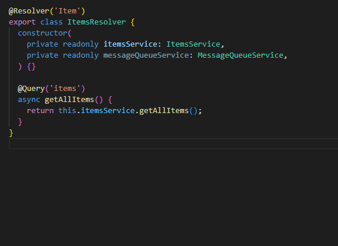
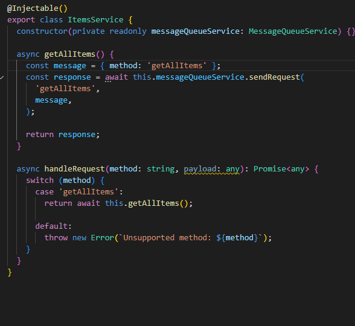
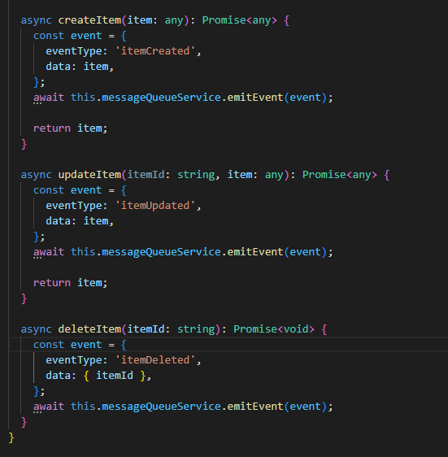
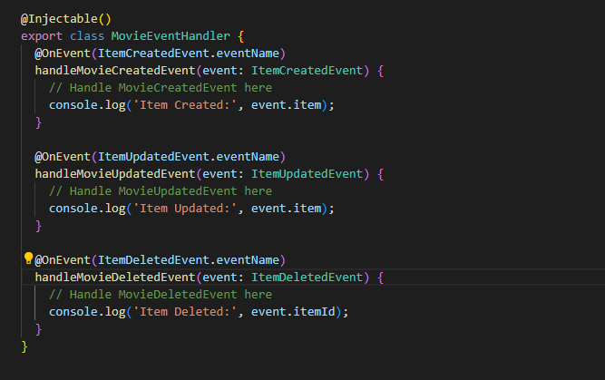
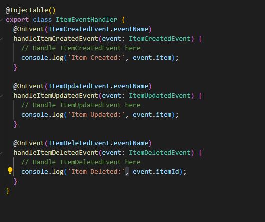

# Solution 3 -Improve API efficiency

Duration: 50-60 Min

### Task 1: Install the necessary dependencies

Open your terminal, navigate to the root directory of your project (where package.json is located) and install the neccessary dependencies:

 - `@nestjs/graphql`
 - `@nestjs/apollo` 
 - `@apollo/server graphql`

### Task 2: Define GraphQL schemas (Code-First with auto-generated schema)

Open `app.module.ts` file and add the following code: 

    imports: [
    GraphQLModule.forRoot<ApolloDriverConfig>({
    driver: ApolloDriver,
    autoSchemaFile: true,})] 
    
    
 Your code should afterwards look like the image below
    
 
    
    
 In order to have nestjs auto-generate the schema we need to annotate each field in our entity (in this example "Movie") with a `field()` annotation.
    
 

### Task 3: Create resolvers

Create a new file named `app.resolver.ts` so you can write your queries and mutations.

 
 
 
 Not to go deep into graphql itself which would be out of the scope of this microhack, a quick summary of how a resolver looks like
 - Annotation which lets nestjs recognize/treat this class as resolver
 - Instead of the CRUD operations we have in REST api here we have **Queries & Mutations**

 
 
 
 In this scenario we are going to return an array of 10x the movie object we created previously.
 
 

### Task 3: Update routes and controllers & test your GraphQL API

Now you can get rid of the the controller file and also update the `app.module.ts` by removing the controller from there also.
Then add the the resolver in the providers list. In the end the app module should look like below:

    @Module({
    imports: [
    GraphQLModule.forRoot<ApolloDriverConfig>({
      driver: ApolloDriver,
      autoSchemaFile: true,
    }),
    ],
    providers: [AppResolver],
    })
    export class AppModule {} 

 

If you reached so far just run the code by running `npm run start:dev` in your terminal (path: root folder).

If the app started you can imediately test your api in your browser in the following url: localhost:3000/graphql

 

**Note!** by default nest picks port 3000 if in your case this port already taken you have to configure nest to run in another port in the `main.ts` file

 

