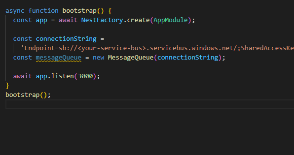

# Solution 3 -Improve API efficiency

Duration: 50-60 Min

### Task 1: Install the necessary dependencies

Open your terminal, navigate to the root directory of your project (where package.json is located) and install the neccessary dependencies:

 - `@nestjs/graphql`
 - `@nestjs/apollo` 
 - `@apollo/server graphql`

### Task 2: Define GraphQL schemas (Code-First with auto-generated schema)

Open `app.module.ts` file and add the following code: ` 
    imports: [
    GraphQLModule.forRoot<ApolloDriverConfig>({
      driver: ApolloDriver,
      autoSchemaFile: true,
    }), `

### Task 2: Prepare the development environment

**Inside your dev box, download Visual Studio Code just like you would in your local environment**

