# **03 Developer Productivity/Developer Velocity**

- [MicroHack introduction and context](#microhack-introduction-and-context)
- [Objectives](#objectives)
- [Prerequisites](#prerequisites)
- [MicroHack Challenges](#challenges)
  - [Challenge 1: How to get up to speed as Developer](#challenge-1-how-to-get-up-to-speed-as-developer)
  - [Challenge 2: Working in a Cloud environment development](#challenge-2-working-in-a-cloud-environment-development)
  - [Challenge 3: Other CED and what is the difference](#challenge-3-other-ced-and-what-is-the-difference)

## Introduction and context

In order to start working on a software project, a developer needs to first set up a development environment containing all the tools, libraries, dependencies and configuration necessary before the actual work can begin. This process is cumbersome, frustrating and very time-consuming. 

This MicroHack scenario walks through the use of modern dev tools  to help you to improve your productivity as a developer with a focus on the best practices and the design principles.  

This lab is not a full explanation of the complete tool set, please consider the following articles required pre-reading to build foundational knowledge. 

[What is a Cloud Environment Development](https://www.cloudshare.com/virtual-it-labs-glossary/cloud-development-environment/) 

[Why would we use the Cloud Environment for Development](https://www.itprotoday.com/development-techniques-and-management/who-needs-or-doesn-t-need-cloud-ides) 

 

If you want to take your knowledge deeper than what will be explained here, we recommand reading: 
[Github Codespaces](https://docs.github.com/en/codespaces) or/and  [Microsoft Dev Box](https://learn.microsoft.com/en-us/azure/dev-box/) 

## Objectives

After completing this MicroHack you will: 

- Understand how to be more productive as a developer  

- Understand How Development Environment can improve productivity 

- know the basics of Cloud Environment Development 

## Lab environment for this MicroHack 

All you need in order to follow is a browser, Visual Studio Code 

## Challenges

### **Challenge 1: How to get up to speed as Developer** 

 

#### Goal 

The goal of this exercise is how to eliminate the installation libraries, dependencies and configuration necessary before the actual work can begin using Github codespaces 

#### Task 1: Open Github Codespaces 

Github offers 60 hours free usage if codespaces and thats what we are gonna select "Start for free" for learning purposes, you can then check the pricing for you purposes. 

#### Task 2: Clone or create a new project 

After that, we will have to sign in with our GitHub account we created. 

As you can see in the image below we have 2 options of getting started: 
(1) chose a template (there are also 3 quick start templates avilable),
(2) clone a repository existing in your GitHub account. 
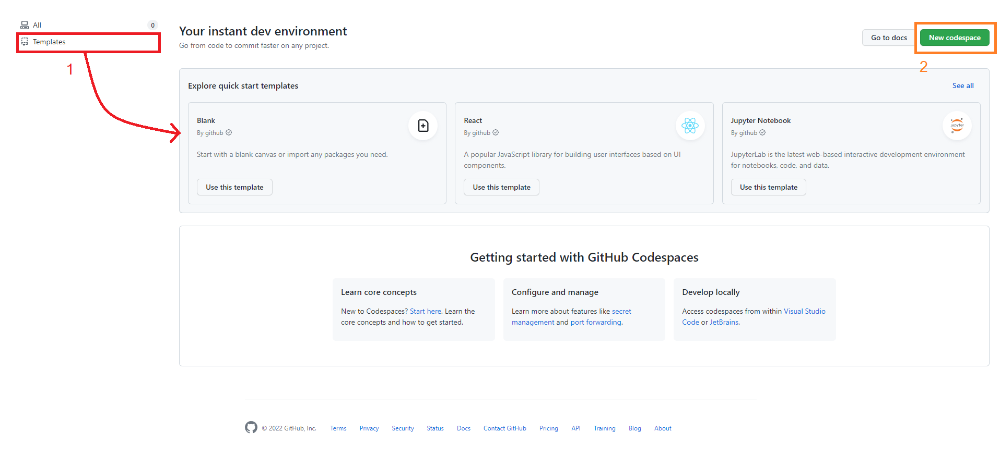
 We will be going with opion one for now. 
 
Click on templates and you will have an extended view on templates to start with. 
We will use the React template for ths MicroHack, so next click on **"Use this template"** inside the React template box. 
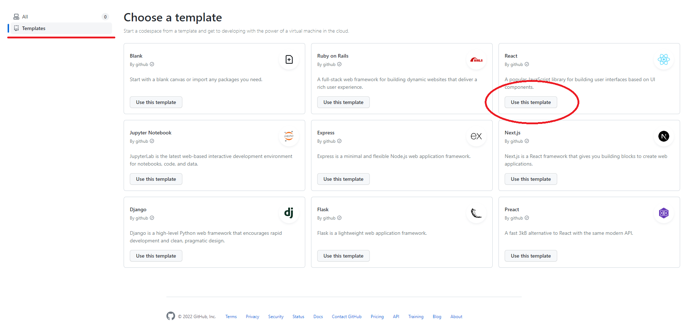

You will be redirected to a new page where if you used Visual studio code before, you should be familiar with, basically this is VS code running on your browser. 
After a few seconds the app should start automatically and you should end up with a few like in the image above. 
If your app did not start, in the terminal run the following command:  `npm start`

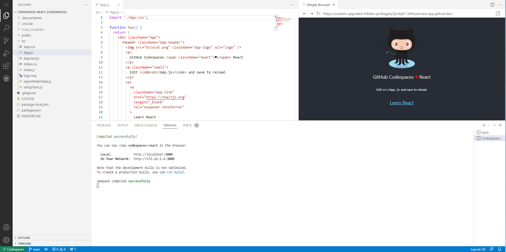

 
Now that we have the basics done, we can proceed to the next challenge. 

### **Challenge 2: Working in a Cloud environment development**  

#### Goal 
In this challenge we will be focusing on making our simple app production ready without having any tools in our local system installed.

#### Task 1: Check the pre-installed tools version 

We can now either create a new terminal or stop the app from running in the current terminal by focusing on the terminal (left mouse click on the terminal field) and pressing **Ctrl + c for windows and linux (CMD + M MacOs)**. 

The webpack should stop compiling our app and we can now write commands on the terminal. 
The first thing we should check is version of packages or libraries we are working on. As an example we can simply write on the terminal `node –version` and get the version of node which is installed in the cloud environment we will develop our project on. 

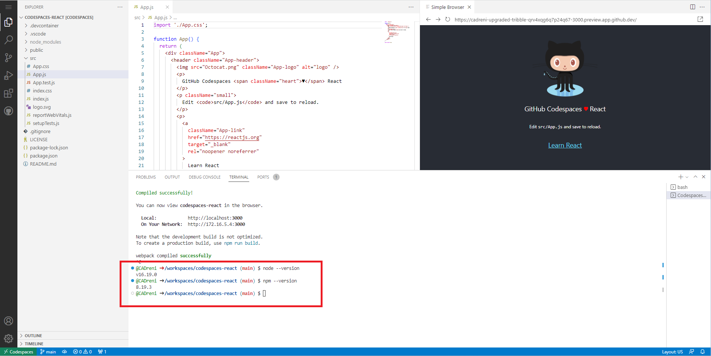

**(Optional)** Also, you can copy the link in the simple browser and paste in a new tab in your browser, you should get the same result but now you will have a cleaner work environment inside VS Code 

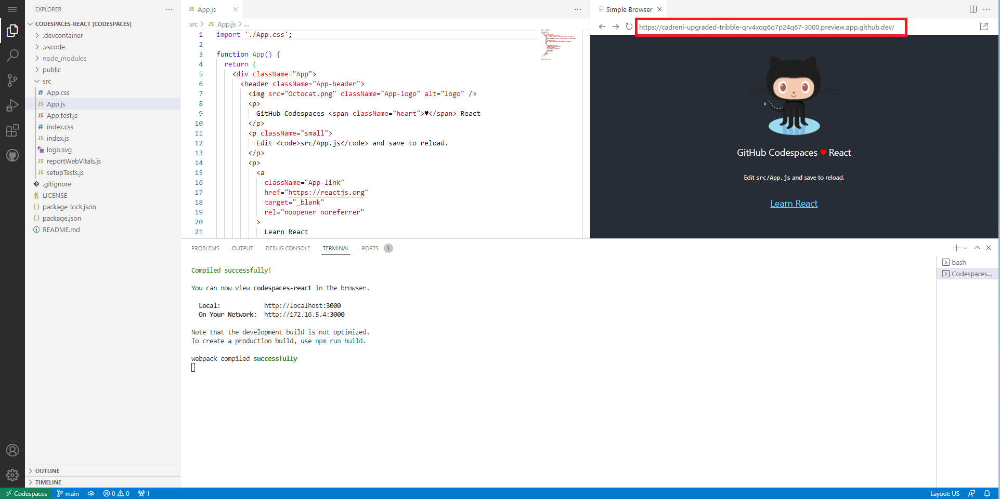

#### Task 2: Code 

Its time we write our first code in our cloud environment development tool.

 
(If you stopped the app from running in task 1) you should start running your app  by giving the following command in the terminal: `npm start`. 

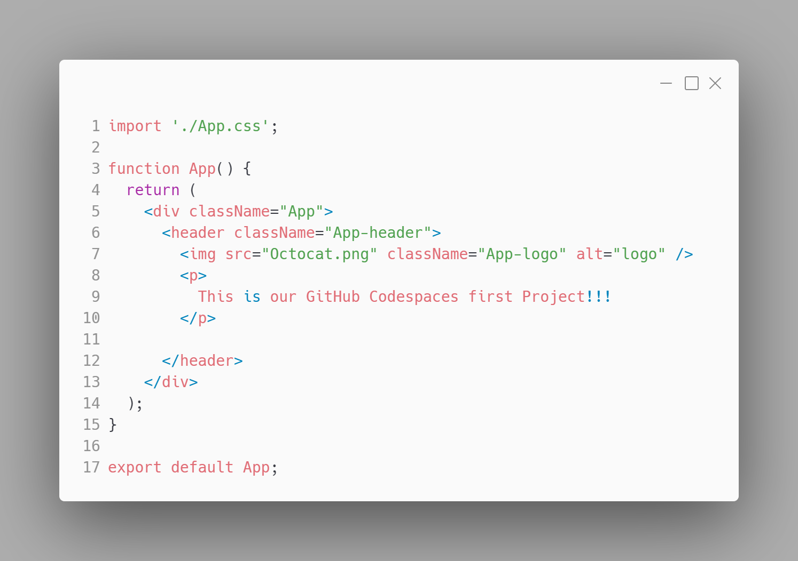

Write the code like the image above and then save the file.
**And this is our first code in GitHub codespaces!!!**

#### Task 3: Push our code in a repository 
We dont need to create any repository by ourselves, GitHub codespaces will create it for us in some clicks only. 
Click on the top-left menu and then **"My Codespaces"**

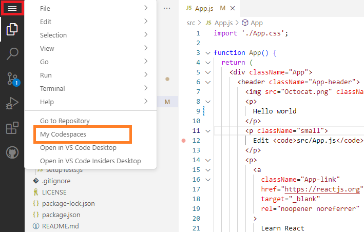

You will then be in the main page of GitHub codespaces but now you can see you created react project in the dashboard.

We should rename our project before we head to the next step.
In the project box appeared below the templates click the menu (three dots, right side of the box) and click on **Rename**. 

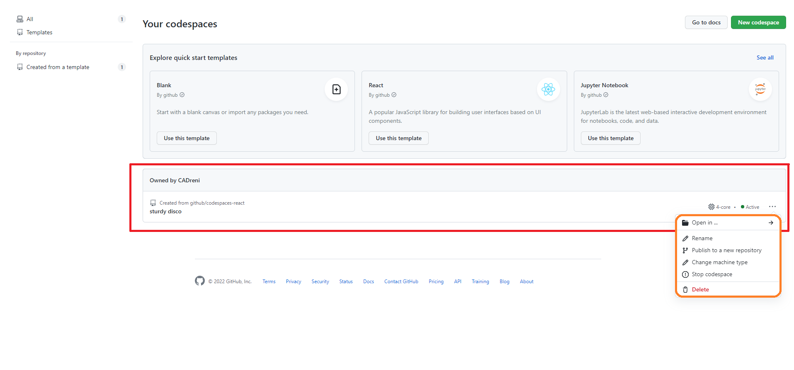

For my Project ive chosen to name it "First GitHub codespaces project".  
After we are done with the name, we should click again on the same menu and then **Publish to a new repository**.

You should then chose if you want your repository to be private or public (you can later change this anytime option). 

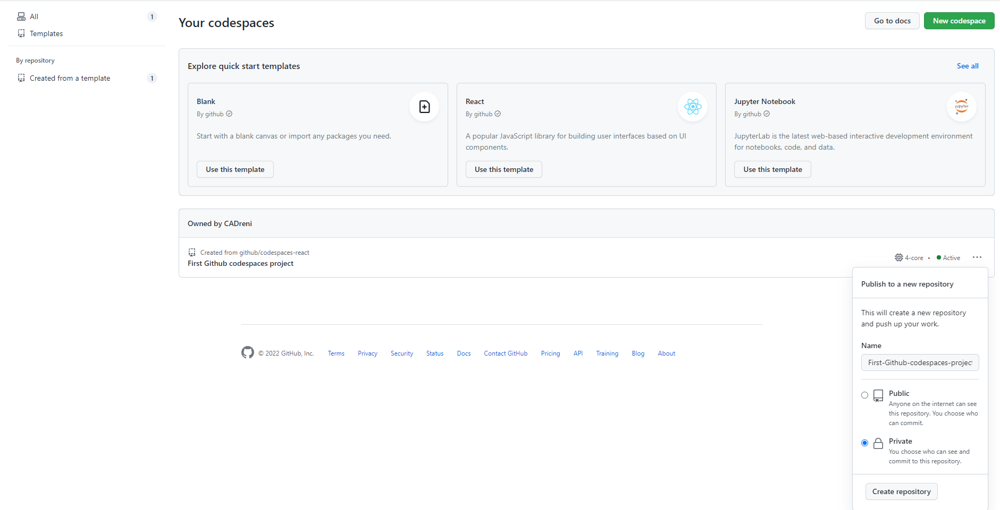

Click on **create repository** and after few seconds the repository will be created with the given name. 

The button then will be replaced with a new button **see repository**, upon clicking it will get you to your new GitHub rository page.

After your repository has been created you now can add collaborators, continue coding localy or deploy it. 

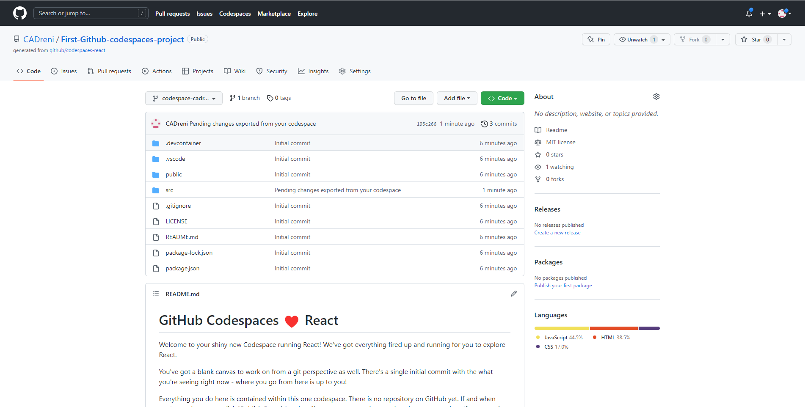

You are free to write the code you like, in my case this is the code i wrote. You can copy then paste, if your compiler does not run at the moment simply  run `npm start` in ur terminal.

#### Task 4: Working on an existing repository. 

Lets see a scenario where you need to work on a existing repository in GitHub codespaces. 

To prepare our Lab for this scenario go to the GitHub codespaces main page again and delete your existing codespace. 

Then we will approach option two of starting a codespace

Press the New Codespace button top-right of the screen  

You will then be moved to a new page where you need to select your repository to work on, branch, region, and machine type. 

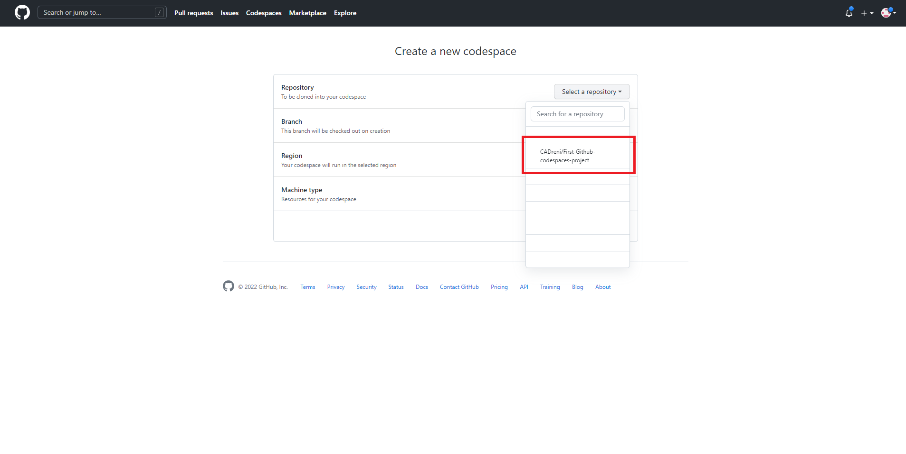

Select the repository we created earlier.
Now we have a field which is not knowt before to us called Dev container Configuration.  
This are configurations predefined for our environment (i.eg Port the app should run at, CPUs minimum requirement etc.) [see more...](https://docs.github.com/en/codespaces/setting-up-your-project-for-codespaces/introduction-to-dev-containers) 

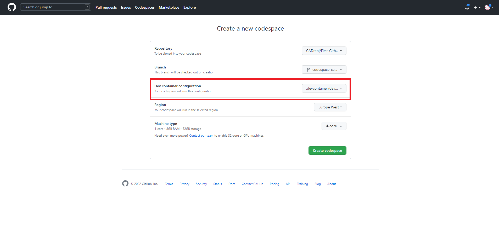

To edit the **devcontainer configuration**, inside your project repository you will find a folder named .devcontainer and inside of it devcontainer.json which then you can edit based on the configuration you want. For now we are going to let the configuration like it is for this microhack. 

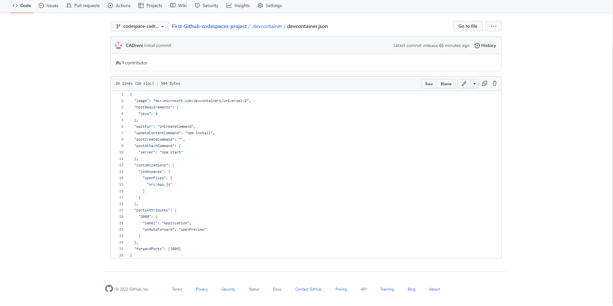

If your devcontainer configuration looks different, in order to follow up with this microhac it is recommanded to set the configuration like the json file above. 

On Machine Type you will recognize that the predefined configuration will not allow you to chose a machine type below that. 

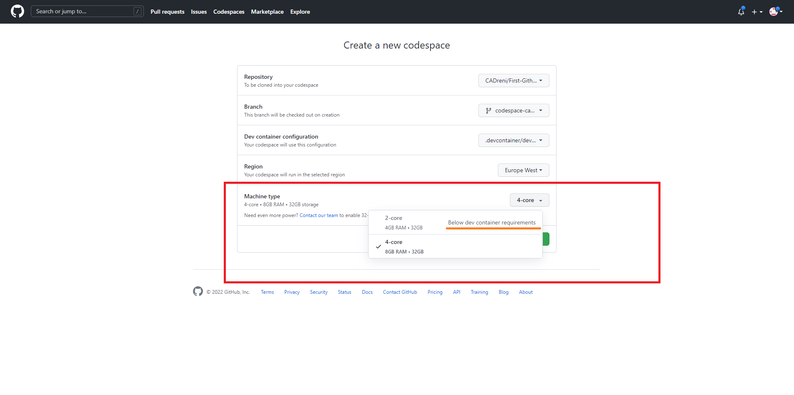

Chose an appropriate machine type and create your codespace. Thats it! Now you are back to your cloud environment and can start imediately to code. 

Before proceeding to challenge 3,  

if you would like to code localy in GitHub codespaces there are ways to do that which are out of the scope of this microhack.  
If you are looking to code localy: [how to use GitHub codespaces in Visual studio code](https://docs.github.com/en/codespaces/developing-in-codespaces/using-github-codespaces-in-visual-studio-code), there is also support for other IDEs. 

### **Challenge 3: Other CED and what is the difference**

#### Goal 
Know other Cloud environment development tools which exist and what fits you best 

#### Task 1: Other CED tools 

There are many possible cloud environments you can chose in the internet like: 

**Microsoft Dev Box,** 

**AWS CLoud9,** 

**GitLab** 

… and the list goes on. 

In this microhack we are going to focus comparing **Microsoft Dev Box** to **GitHub codespaces** and see what would benifit you more depending on the project you have or plan to have. 

#### Task 2: GitHub codespaces or Microsoft Dev Box 

(1) GitHub codespaces runs on Linux where as Microsoft Dev Box runs on Windows. 

(2) Source Code Management on GitHub codespaces is supported only on github, in Microsoft Dev Box any version control system would do the job. 

(3) GitHub codespaces supports workloads like Web Apps, APIs, Backends Microsoft Dev Box on the other hand any workload including desktop, games and much more 

(4) The IT in GitHub CodeSpaces is managed by github.com team and Microsoft Dev Box by the Endpoint Manager & Microsoft Azure.

#### Task 3:  What is the best opion for you  

If we have a simple app like we have developed in this microhack then both opionions would do for development. 

In Production if the plan is Azure then Microsoft Dev Box would be a more ideal pick. 

 
For windows users Microsoft Dev Box offers an amazing feature running the cloud environament as a desktop page in which you also have access to other Microsoft software like office. 

 
To wrap everything up, in the end it depends on the needs and/or personal preference which one to go for. 

 
This was a basic introduction to Cloud Environment Development and is by far not everything what cloud environment offers you as a developer. It is recommanded to try on your own and see based on your personal experience where you would find yourself more productive. 

#### Task 4: Where have we reached 

 

By now your created GitHub repository which you created should look like [this](https://github.com/CADreni/First-Github-codespaces-project). 

 

If you ran into any problems it is good to double check if you missed any task or part of the challenge. 

 

**Note!** If you delete the repository, your codespace will be deleted aswell! 

