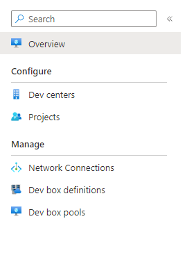
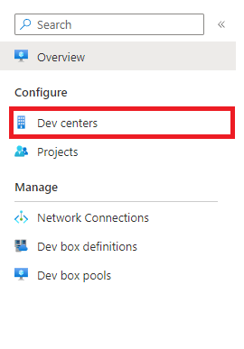
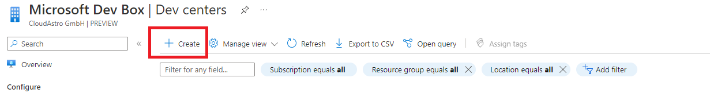
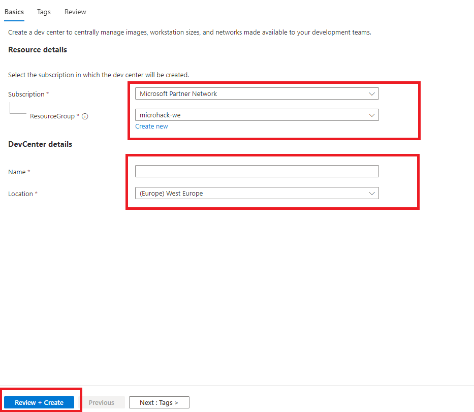
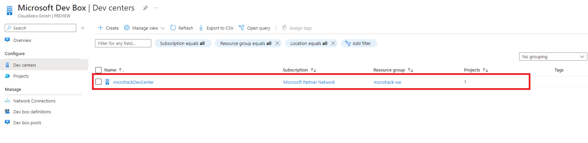
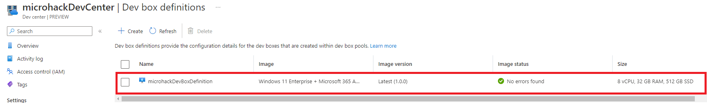
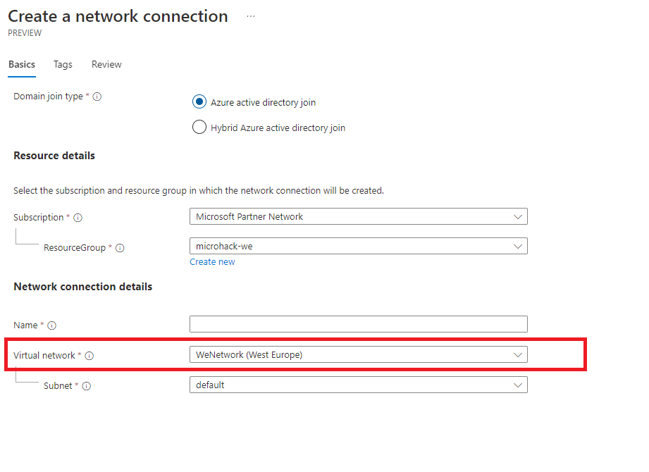
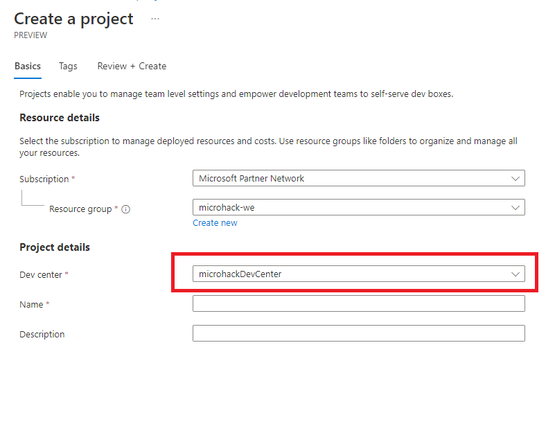

# Solution 1 - How to get up to speed as Developer

Duration: 40-50 Min

### Task 1: Create a Dev Box

**After you are logged in to the provided link you should see the config and management panel**

**Next we need to create a Dev Center**
**Click on "Dev Centers"**

**Click on "create"**

**Then give the information required (Subscription, Name and dev center location).**
**When done press the "Review + Create" button. This will make the review and create the dev center (if no errors).**

 
**If you now should go back to "Dev Centers", the dev center your created should appear.
Now click on the dev center you created.**

**Next we need to create a dev box definition. Left in the dev center page in the panel you should see "Dev box definitions". Click
to create one.**

**Probably your Dev box lsit is empty, so you need to create one just like the dev center click on "Create" on top of the page**

**Then you need to setup the definition by giving the name, image and computing. Then click on "Create"**

**Note!** You can create [custom images](https://learn.microsoft.com/en-us/azure/dev-box/how-to-configure-azure-compute-gallery) with preinstalled tools (out of the scope of this microhack)

**After you successfully created the Dev box definition it should appear in your Dev box definition list**

**After we have created our Dev box definition next we need to create a Network Connection. Again in the main panel click on "Network Connections"**

**Your list should be empty and just like the previous steps on top of the page click on "Create"..**
**Next select the subscription, in the Network connection details you need a virtual network. If the options are empty follow this guide to [set up
a virtual network](https://learn.microsoft.com/en-us/azure/dev-box/how-to-manage-network-connection?tabs=AzureADJoin)**

**After we successfully created the network go back to the dev center page, click on "Networking" in the left panel. A menu will open in the right
side of the page, in the dropdown you should see the network you created as an option. Set the created network connection as option here
and click "Add"**

**Nextt, next we are going to create a Project. Go back to the main panel and click on "Projects"**

**Just like the other steps, click on "Create"**

**Next you need to provide a Subscription, name, description and a Dev Center. The Dev center we previously created should appear as an option. Set the created 
dev center in this field. After that Create the Project**

**When your project is created it should appear in your project list.**

**Finally we need to create a Dev box pool**
**In the Projects list, click on the project we crated and then in the panel click on Dev box pools**

**Next create a new Dev box pool, click on "Create" on top of the page**

**Next you need to give it a name, dev box definition (which we created), Network connection (which we created).
set Enable Auto-stop to "No" for now and click "Create"**

**We have set up everything. Next we set the project access. Go back to the main panel, click on Projects and then click on the project we created.
Next, click on "Edit access"**

**On top of the page click on "Add"**

**And then  "Add role assignment"**

**Select a role (Dev Box User for this microhack), then click next**

**Next in the Members tab click on "Select members", a menu will open on the right side of the page, select your account and then assign yourself 
the role as a demo**

**After you assigned yourself a role its time to create a dev box. go to [https://aka.ms/devbox-portal](https://aka.ms/devbox-portal) then you
should see on the top right of the screen a button "New dev box" click on it**

**Give your dev box a name**

**You can run your dev box in the browser or for windwos users also in RDP Client**

### Task 2: Prepare the development environment

**Inside your dev box, download Visual Studio Code just like you would in your local environment**

