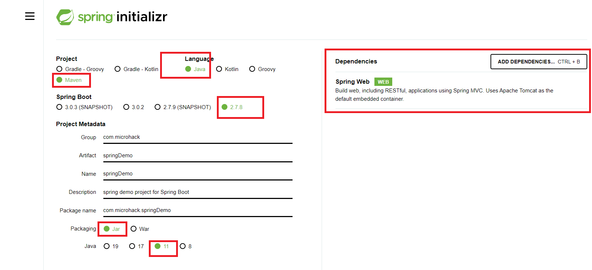
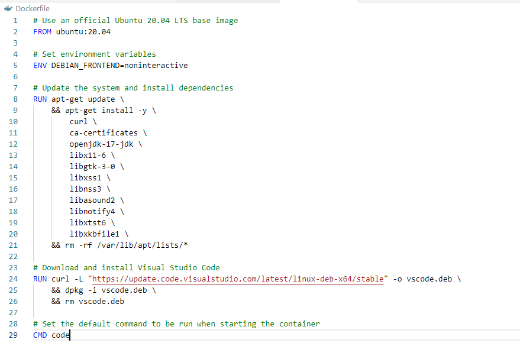
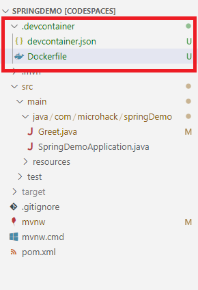
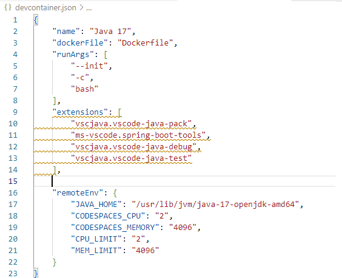
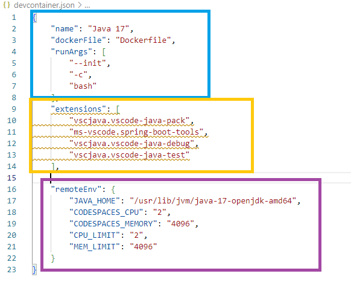
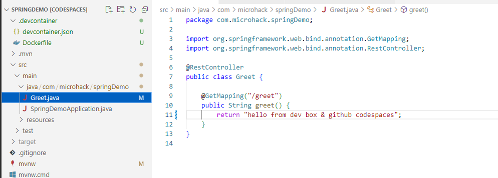

# Solution 2 - Comparison between Microsoft Dev Box and Github Codespaces 

Duration: 60-75 Min

### Task 1: Create a reusable Microsoft dev box image ready for a Java 17 spring boot project

Now that we have a dev box created lets create an image for a Java Spring Boot project.

- Go back to Azure and create a Compute Gallery.

- Now create a Virtual Machine image definition. In this microhack we are not covering how to create VMs but you can easily follow [this guide](https://learn.microsoft.com/en-us/azure/virtual-machines/windows/quick-create-portal). 

VM generation has to be Gen 2!

- After you succeeded creating the VM, start the it and install the necessary tool for your java Spring Boot project.

  Download and install JDK [here](https://www.oracle.com/java/technologies/downloads/#jdk19-windows)
  
  Download and install IntelliJ [here](https://www.jetbrains.com/idea/download/#section=windows)
  
  
  
  
  - Now open the VM again and follow the path like in the image below, click on `sysadmin` and check the checkbox to make the vm Generalized settings like below.
  
   
   
   After that the VM should turn off itself. Stop the VM right after and press on "Capture".
   
  
  
  Then you should get a page like below where you need to configure the image
  
   
   
   
   Before you centinue you also need now to create a Managed Identity in azure, go ahead and create one. 
   
   
   
   After its created you need to add the Identity to the Dev Center we created, also add the created Gallery.
   
   
   
   
   - Next when you create a new dev box definition you should see the custom VM image and upon clicking it you will have a dev box with the pre-installed
    tools for a spring project. Now you can delete dhe previous dev definition, (you will need to delete the dev box pool too). 
    Create a new dev definition in a and/or new project  and dev pool (just like in [challenge 1](../challenges/01-How-to-get-up-to-speed-as-Developer-using-Cloud-Environment-Development.md))
   
   
   
   

### Task 2: After your environment is ready now create the project and push your code in a Source Code Repo.

Now you should go back to ([Dev Box Portal](https://aka.ms/devbox-portal)) create a new dev box and open it.

Inside your dev box open (Optional: [spring initializr](https://start.spring.io/)) 

 
 
 Next unzip and open the project. Create a new java class in `src/main/java/com.[the names you provided]`.
 Write the code like the image below and start the Project
 
 

- Next push your code in you Github Repository (we will need this for our next Task!).

### Task 3: Github Codespaces environment setup

- In your browser open [Github Codespaces](https://github.com/features/codespaces). Login with your github account.

- Clone your repo from the previous task 

- Configure the cpu and memory.

In the root level of the project create a Dockerfile and write the following code 

Now create a `.devcontainer` folder and and add `devcontainer.json` & `Dockerfile`

- Inside the `devcontainer.json` file add the following configuration.

**Note**  you can also press `ctrl/cmd + shift + p` and write `>devcontainer` and generate a premade devcontainer for your project.

**Important**: If you want your exstensions to install automatically you should add the following config at line 15 of the `devcontainer.json` file

**note** The yellow curly lines suggest that the developer should install the extensions manually from the VS code extensions tab. This is also the way to install other extensions of choice.

` "postCreateCommand": "code --install-extension vscjava.vscode-java-pack --install-extension ms-vscode.spring-boot-tools --install-extension vscjava.vscode-java-debug --install-extension vscjava.vscode-java-test",` 

**Now lets see what the devcontainer is all about**

 - Blue: Base Config about the project
 
 - Yellow: Extensions which are mandatory or recommanded for working in that Project
 
 - Purple: Scalability

### Task 4: Make changes in the project and run the project in github codespaces

Inside github codespaces open the `Greet.java` class and make changes in the string we return.

Now open the Terminal and write `./mvnw spring-boot:run`  this should run the project. (In case the command should be denied give this command `chmod +x mvnw` and run `./mvnw spring-boot:run` again)

**If the Project runs, that's it! you are done!**

### Task 5: Make a comparison between Microsoft Dev Box and Github Codespaces

**Microsoft Dev Box and Github Codespaces general differences**

(1) GitHub codespaces runs on Linux where as Microsoft Dev Box runs on Windows. 

(2) Source Code Management on GitHub codespaces is supported only on github, in Microsoft Dev Box any version control system would do the job. 

(3) GitHub codespaces supports workloads like Web Apps, APIs, Backends Microsoft Dev Box on the other hand any workload including desktop, games and much more 

(4) The IT in GitHub CodeSpaces is managed by github.com team and Microsoft Dev Box by the Endpoint Manager & Microsoft Azure.

**Accessibility:**

As you have noticed, both Microsoft Dev Box and GitHub Codespaces provide developers with accessibility to their development environments from any device with an internet connection. However, GitHub Codespaces is designed as a purely cloud-based service, which means that developers can access their development environments from anywhere in the world without the need for any local infrastructure. In contrast, Microsoft Dev Box is a cloud-based VDI solution that requires a cloud PC with needed tools to which developers can connect either through the web browser or secure RDP connection.

**Security:**

From what you saw, both services provide strong security features to protect developer code and data. Microsoft Dev Box is built on Azure Virtual Desktop technology and natively integrated into Azure AD, which provides several security features, such as network isolation and user authentication, MFA, Conditional Access Policies to ensure that the virtual desktop environment is secure. GitHub Codespaces is built on top of GitHub, which is known for its strong focus on security, and it provides several security features, such as encrypted traffic, continuous monitoring of security vulnerabilities and two-factor authentication, to ensure that developer code and data are secure.

**Cost:**

Both services have different pricing models. Microsoft Dev Box is a consumption-based solution, which means that users are charged based on the resources they use. The cost of using Microsoft Dev Box can vary depending on the amount of resources used and the length of a project but I can be significantly lower using for example Auto Shut down schedules and demoting the environment at the end of projects. GitHub Codespaces, on the other hand, is available as a monthly subscription service, which allows developers to pay for only what they need. The cost of GitHub Codespaces varies depending on the pricing tier you choose and you can set a maximum monthly cap for extra cost control.

**Flexibility:**

Both services provide a range of features to support developers in their work. Microsoft Dev Box as well as GitHub Codespaces provide developers with a high level of flexibility in terms of the programming languages and frameworks they can use. Microsoft Dev Box is optimized for development with Microsoft tools, but it can also support a wide range of other programming languages and frameworks. GitHub Codespaces provides a wide range of pre-configured 

**Note!** We created a java version 11 project and spring boot 2 because out of the box github codespaces does not support java 17 as default and the setup to make it work requires github actions and other configuration which are sometimes complex and not as easy as in the dev box where we would just start the project,

**There are other differences too e.g in Microsoft Dev Box you could do a Unity project for games which would not be supported in github codespaces.**

**What is the best opion for you**  

This was a basic introduction to Cloud Environment Development and is by far not everything what cloud environment offers you as a developer. It is recommanded to try on your own and see based on your personal experience where you would find yourself more productive. 
