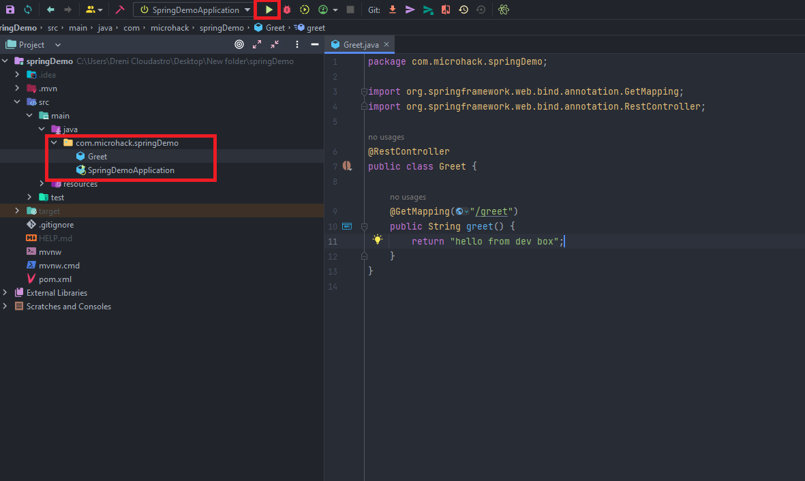

# Solution 2 - Comparison between Microsoft Dev Box and Github Codespaces 

Duration: 60-75 Min

### Task 1: Create a reusable Microsoft dev box image ready for a Java 17 spring boot project

Now that we have a dev box created lets create an image for a Java Spring Boot project.

- Go back to Azure and create a Compute Gallery.

- Now create a Virtual Machine image definition. In this microhack we are not covering how to create VMs but you can easily follow [this guide](https://learn.microsoft.com/en-us/azure/virtual-machines/windows/quick-create-portal). 

VM generation has to be Gen 2!

- After you succeeded creating the VM, start the it and install the necessary tool for your java Spring Boot project.

  Download and install JDK [here](https://www.oracle.com/java/technologies/downloads/#jdk19-windows)
  
  Download and install IntelliJ [here](https://www.jetbrains.com/idea/download/#section=windows)
  
  
  
  
  - Now open the VM again and follow the path like in the image below, click on `sysadmin` and check the checkbox to make the vm Generalized settings like below.
  
   
   
   After that the VM should turn off itself. Stop the VM right after and press on "Capture".
   
  
  
  Then you should get a page like below where you need to configure the image
  
   
   
   
   Before you centinue you also need now to create a Managed Identity in azure, go ahead and create one. 
   
   
   
   After its created you need to add the Identity to the Dev Center we created, also add the created Gallery.
   
   
   
   
   - Next when you create a new dev box definition you should see the custom VM image and upon clicking it you will have a dev box with the pre-installed
    tools for a spring project. Now you can delete dhe previous dev definition, (you will need to delete the dev box pool too). 
    Create a new dev definition in a and/or new project  and dev pool (just like in [challenge 1](../challenges/01-How-to-get-up-to-speed-as-Developer-using-Cloud-Environment-Development.md))
   
   
   
   

### Task 2: After your environment is ready now create the project and push your code in a Source Code Repo.

Now you should go back to ([Dev Box Portal](https://aka.ms/devbox-portal)) create a new dev box and open it.

Inside your dev box open (Optional: [spring initializr](https://start.spring.io/)) 

 
 
 Next unzip and open the project. Create a new java class in `src/main/java/com.[the names you provided]`.
 Write the code like the image below and start the Project
 
 

### Task 3: VS Code Extensions

Open VS Code and in the Extensions tab search for "Live Server" and install it (apply on dev box and codespaces).
After you are done installing, Press "Go Live" which now appeared in VS Code and your app should appear in the browser automatically.

### Task 4: Source Code Management

- In Microsoft dev box you can push your code to Github or Azure DevOps just like you would in an local environment.

- Github Codespaces offers an easier solution to directly create a new repository

In Github Codespaces go to the main page and click on the (three dots right side of the box) Menu and then "Publish to a new repository"

Now you can also rename the project and click on "Create Repository"

**Microsoft Dev Box and Github Codespaces general differences**

(1) GitHub codespaces runs on Linux where as Microsoft Dev Box runs on Windows. 

(2) Source Code Management on GitHub codespaces is supported only on github, in Microsoft Dev Box any version control system would do the job. 

(3) GitHub codespaces supports workloads like Web Apps, APIs, Backends Microsoft Dev Box on the other hand any workload including desktop, games and much more 

(4) The IT in GitHub CodeSpaces is managed by github.com team and Microsoft Dev Box by the Endpoint Manager & Microsoft Azure.

**What is the best opion for you**  

This was a basic introduction to Cloud Environment Development and is by far not everything what cloud environment offers you as a developer. It is recommanded to try on your own and see based on your personal experience where you would find yourself more productive. 
