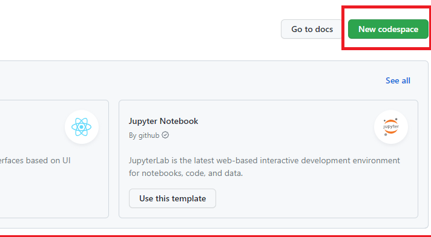

# Solution 1 - Comparison between Microsoft Dev Box and Github Codespaces 

Duration: 30-45 Min

### Task 1: Create app in Microsoft Dev Box

Now inside your dev box, open Visual Studio Code and create a `index.html` file. For this example we will only create a header "Hello World".
In the bottom right of the page you should see "Go Live" in the image below, ignore it for now.

### Task 2: Github Codespaces setup

Login to [Github Codespaces](https://github.com/features/codespaces).
In the homepage click on "Get started for free"

Next create a blank Project. Open create a `index.html` file and apply the same code like Task 1.

We now have a simple app on both environments, don't hesitate to play around longer, for this microhack this should be only an introduction.

### Task 3: VS Code Extensions

Open VS Code and in the Extensions tab search for "Live Server" and install it (apply on dev box and codespaces).
After you are done installing, Press "Go Live" which now appeared in VS Code and your app should appear in the browser automatically.

### Task 4: Source Code Management

- In Microsoft dev box you can push your code to Github or Azure DevOps just like you would in an local environment.

- Github Codespaces offers an easier solution to directly create a new repository

In Github Codespaces go to the main page and click on the (three dots right side of the box) Menu and then "Publish to a new repository"

Now you can also rename the project and click on "Create Repository"

**Microsoft Dev Box and Github Codespaces general differences**

(1) GitHub codespaces runs on Linux where as Microsoft Dev Box runs on Windows. 

(2) Source Code Management on GitHub codespaces is supported only on github, in Microsoft Dev Box any version control system would do the job. 

(3) GitHub codespaces supports workloads like Web Apps, APIs, Backends Microsoft Dev Box on the other hand any workload including desktop, games and much more 

(4) The IT in GitHub CodeSpaces is managed by github.com team and Microsoft Dev Box by the Endpoint Manager & Microsoft Azure.

**What is the best opion for you**  

This was a basic introduction to Cloud Environment Development and is by far not everything what cloud environment offers you as a developer. It is recommanded to try on your own and see based on your personal experience where you would find yourself more productive. 
