# Challenge 1 - How to get up to speed as Developer Solution

Duration: ~30-45 Min

### Task 1: Create a Dev Box

**After you are logged in to the provided link you should see the config and management panel**

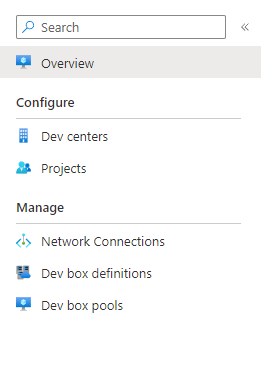

**Next we need to create a Dev Center**
**Click on "Dev Centers"**

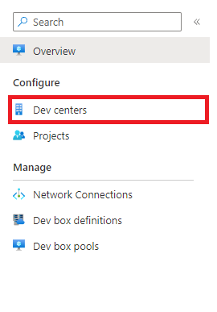

**Click on "create"**

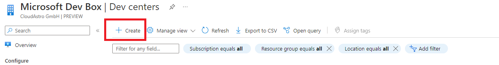

**Then give the information required (Subscription, Name and dev center location).**
**When done press the "Review + Create" button. This will make the review and create the dev center (if no errors).**

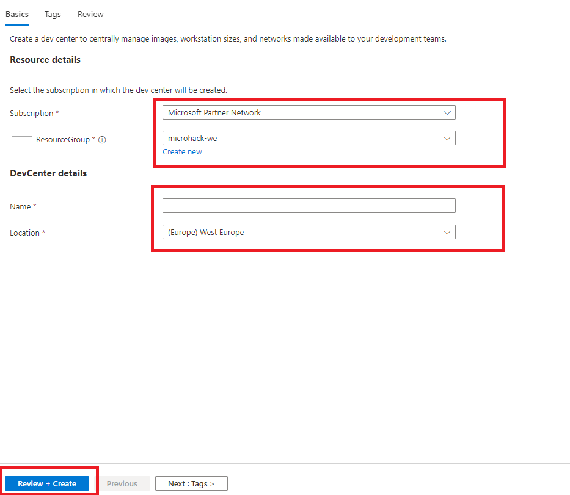

 
**If you now should go back to "Dev Centers", the dev center your created should appear.
Now click on the dev center you created.**

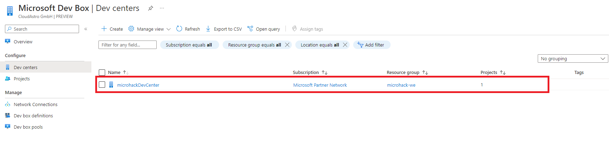

**Next we need to create a dev box definition. Left in the dev center page in the panel you should see "Dev box definitions". Click
to create one.**

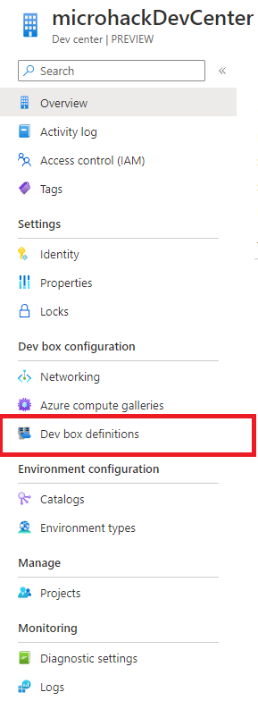

**Probably your Dev box lsit is empty, so you need to create one just like the dev center click on "Create" on top of the page**

**Then you need to setup the definition by giving the name, image and computing. Then click on "Create"**

**Note!** You can create [custom images](https://learn.microsoft.com/en-us/azure/dev-box/how-to-configure-azure-compute-gallery) with preinstalled tools (out of the scope of this microhack)

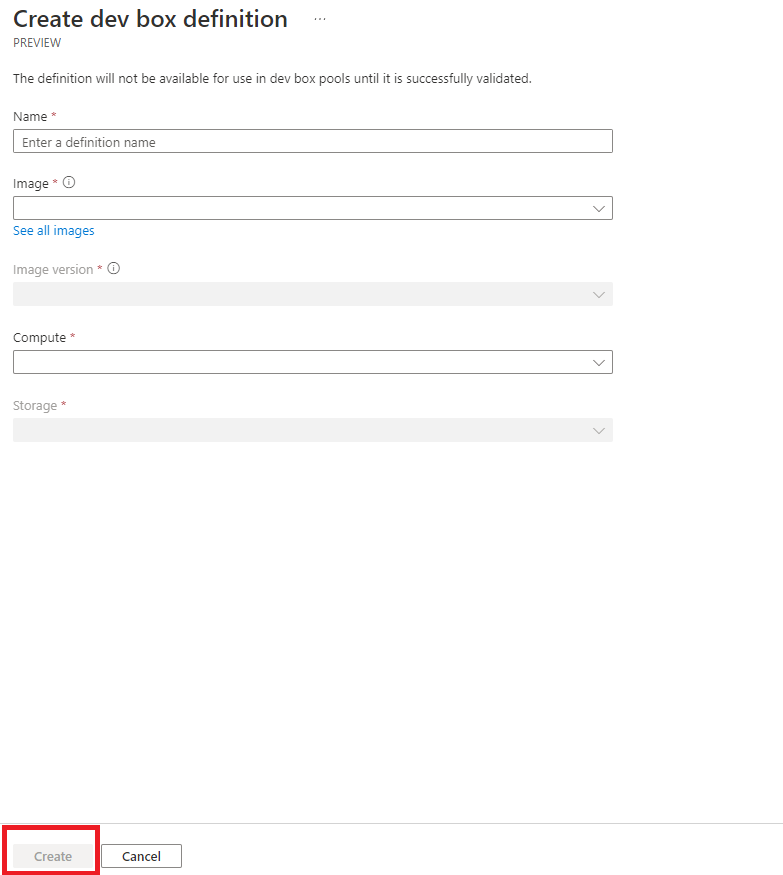

**After you successfully created the Dev box definition it should appear in your Dev box definition list**

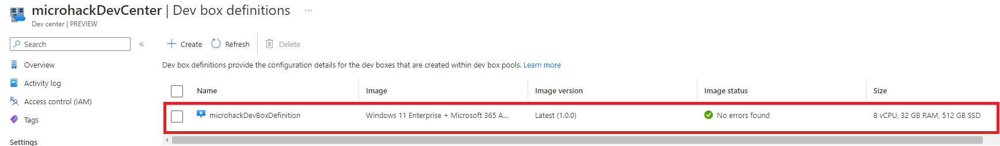

**After that, next we are going to create a Project. Go back to the main panel and click on "Projects"**

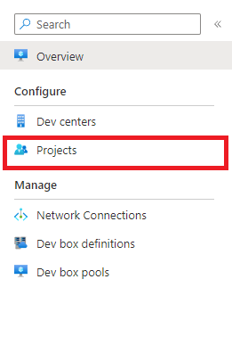

**Just like the other steps, click on "Create"**

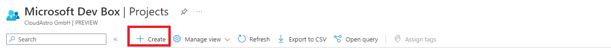

**Next you need to provide a Subscription, name, description and a Dev Center. The Dev center we previously created should appear as an option. Set the created 
dev center in this field. After that Create the Project**

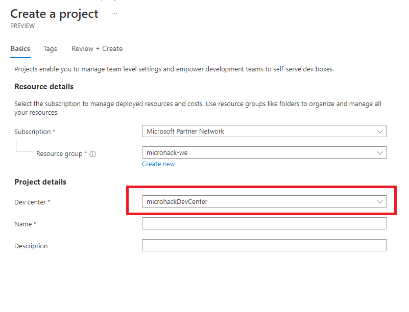

**After we have created our project next we need to create a Network Connection. Again in the main panel click on "Network Connections"**

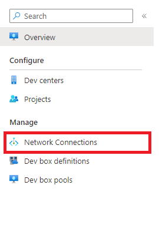

**Your list should be empty and just like the previous steps on top of the page click on "Create"..**
**Next select the subscription, in the Network connection details you need a virtual network. If the options are empty follow this guide to [set up
a virtual network](https://learn.microsoft.com/en-us/azure/dev-box/how-to-manage-network-connection?tabs=AzureADJoin)**

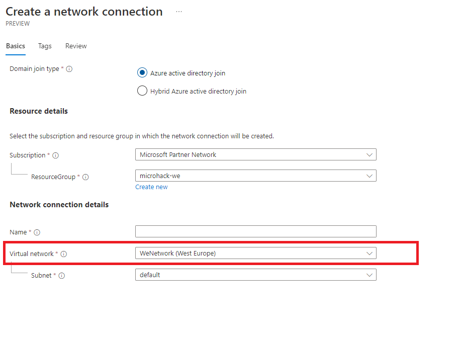

**After we successfully created the network**

