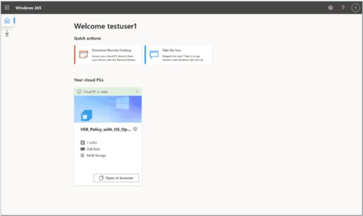

# Solution 3 - Comparison VDI and Microsoft Dev Box

Duration: 45min-60 Min

### Task 1: Windows 365 - “Desktop as a Service” (DaaS)

Once the required licensed is obtained, sing in to the Microsoft 365 Admin Center portal where you can assign license to your user account 

- Select the user and assign Windows 365 license.

-	Sign in to your Windows 365 PC [https://windows365.microsoft.com/](https://windows365.microsoft.com/) and start setting it up.

- Install required applications as you would normally do on your local PC.
- Cancel Windows 365 within a month to avoid any charges.

### Task 1: Azure Virtual Desktop

- Sign in to the Azure Portal 
- Create a new Resource Group for the AVD resources.

-	Create vNet and Subnet for your AVD environment.

**Create new Personal Host Pool**

- Search for Azure Virtual Desktop and select it from the list.

- Under Manage, select Host pools, and select + Create.

- On the Basics page, change Validation environment to No. Set the host pool type to Personal and Assignment type to Automatic. Once complete, select Next: Virtual Machines.

- 4.	On the Add Virtual Machine page, configure VM settings:
      -	Resource Group: The Resource Group you deployed the host pool in.
      -	Name prefix: Choose best suitable for you.
 	    - Virtual machine location: Location you deployed your other AVD resources.
      - Available options: No infrastructure redundancy required.
	    - Image: select a minimum of Windows 10 Enterprise, version 21H2.
      -	Virtual network: The AVD virtual network you created.
      -	Domain to join: select Azure Active Directory.
      -	Virtual Machine Administrator account: set local admin and password.

      -

