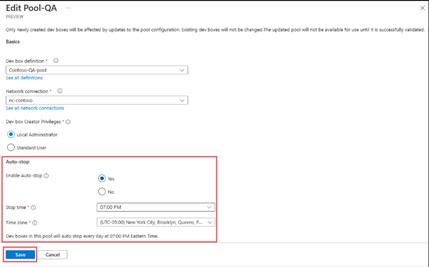

# Solution 3 - Comparison VDI and Microsoft Dev Box

Duration: 45 min-60 Min

### Task 1: Windows 365 - “Desktop as a Service” (DaaS)

Once the required licensed is obtained, sing in to the Microsoft 365 Admin Center portal where you can assign license to your user account 

- Select the user and assign Windows 365 license.

-	Sign in to your Windows 365 PC [https://windows365.microsoft.com/](https://windows365.microsoft.com/) and start setting it up.

- Install required applications as you would normally do on your local PC.
- Cancel Windows 365 within a month to avoid any charges.

### Task 2: Azure Virtual Desktop

- Sign in to the Azure Portal 
- Create a new Resource Group for the AVD resources.

-	Create vNet and Subnet for your AVD environment.

**Create new Personal Host Pool**

- Search for Azure Virtual Desktop and select it from the list.

- Under Manage, select Host pools, and select + Create.

- On the Basics page, change Validation environment to No. Set the host pool type to Personal and Assignment type to Automatic. Once complete, select Next: Virtual Machines.

- On the Add Virtual Machine page, configure VM settings:
 1. Resource Group: The Resource Group you deployed the host pool in.
      	
 2. Name prefix: Choose best suitable for you.
      	
 3. Virtual machine location: Location you deployed your other AVD resources.
       
 4. Available options: No infrastructure redundancy required.
       
 5. Image: select a minimum of Windows 10 Enterprise, version 21H2.
       
 6. Virtual network: The AVD virtual network you created.
      	
 7. Domain to join: select Azure Active Directory.
      	
 8. Virtual Machine Administrator account: set local admin and password.

- On the Workspace page, select Yes to register a new desktop app group. Select Create new and provide a Workspace name. Select OK and Review + create.

- Assign an Azure AD user or group to an application group
1.	Search for Azure Virtual Desktop and select it from the list of your services
2.	Under Manage, select Application groups.
3.	Locate the Application group created in previous steps, the name will look like (<poolName>-DAG). Select the name to manage the Application group.
4.	Under Manage, select Assignments, and select + Add.
 
 
 
 
 5.	In the search box, search for your Azure AD user or group that you want to add.
 
  
 
-	Navigate to [https://client.wvd.microsoft.com/arm/webclient/index.html](https://client.wvd.microsoft.com/arm/webclient/index.html)  and logon to your AVD session host.
 
 
   
 
   
 
   
 
 
 ### Task 3: Install required applications and remove resources.

 
- Install required applications as you would normally do on your local PC.
- Cancel Windows 365 license, delete Azure resources created for AVD.
 
 
 **Notes & Guidance:**
 
 Accessibility: 
 
 
 As you must have noticed, all three VDI technologies such as Windows 365, Azure Virtual Desktop, Microsoft Dev Box are cloud based personalized PCs that allow you to work from anywhere on any device as long as you have Internet access.
 
 
Developers can use these cloud PCs as a workstation that can be securely accessed either through the web browser though the respective end-user portal or RDP which would require downloading and installing the RDP client.
 
 
 
 
 
 Security: 
 
 
 As mentioned before, Microsoft Dev Box is a Windows 365/Cloud PC that can be accessed from anywhere using a secure and encrypted connection which uses outbound port 443 that Azure Virtual Desktop technology is built on.
 
 
You can implement additional security measures since Microsoft Dev Box as well as other cloud-based PCs are natively joined to an Azure AD or Active Directory domain therefore can be securely managed by the organizations using Microsoft Endpoint Manager and device management platforms such as Intune to keep the dev boxes up to date to avoid exposing sensitive data. Dev boxes can be secured using Azure Conditional Access policies that would require users to connect from a complaint device, enable MFA and configure risk-based sign-in policies for the dev boxes that access sensitive source code or customer data.
 
 
  
 
  
 
  
 
 
 Cost:
 
 
 During the setup of each VDI solution, you saw that they are not billed in the same way. Microsoft Dev Box is a high-performance cloud-based workstation that is billed on the consumption-based model (Compute and Storage consumption) in similar way to AVD that requires more services to run whereas Windows 365 uses a fixed-price monthly service designed for simple usage and management for the end-users. 
 
 [Microsoft Dev Box Pricing](https://azure.microsoft.com/en-us/pricing/details/dev-box/#pricing)
 
 [Microsoft Dev Box Preview service configuration](https://learn.microsoft.com/en-us/azure/dev-box/quickstart-configure-dev-box-service?tabs=AzureADJoin)
 
 
 
 [Microsoft 365 Plans and Pricing](https://www.microsoft.com/en-us/windows-365/all-pricing)
 
 
 
 To help save and control the cost of the consumption-based AVD and Dev Box in the Dev Box Pool scenarios, you can enable Auto-Stop Schedule that would shut down the dev boxes at the time specified in the schedule. It is good practice to tear down the Dev Box resources once the project is completed, and cloud PCs are no longer needed.
 
 
 [How to manage a dev box auto-stop schedule](https://learn.microsoft.com/en-us/azure/dev-box/how-to-manage-stop-schedule)
 
  
 
 
 
 Flexibility:
 
 
 When it comes to the flexibility and purpose of a traditional Virtual Desktop Infrastructure VDI, whether it is cloud-based such as Azure Virtual Desktop, or on-premises such as Remote Desktop Services, it is built mostly as a pool of machines that are intended to be shared by multiple users. These pools are managed by a team of IT admins, regularly patched, require additional configuration and maintenance and are intended to be a permanent cloud PC to perform specific tasks in a secure environment.
 
 
Microsoft Dev Box differs from the traditional VDI as its goal is to be a  ready-to-code developer workstation on demand that can be created and deleted fast by the Project Admins with the required tools using one of the pre-defined images or the image definition developed and maintained by the developers from the Azure Computer Gallery.

 

  
 
  
 
  [Configure an Azure Compute Gallery - Microsoft Dev Box Preview](https://learn.microsoft.com/en-us/azure/dev-box/how-to-configure-azure-compute-gallery)
 
  
 
  
 
  
 
  
 
 For ease of managing of multiple workstations, dev box pools can be also created and assigned to a required project to which Project Admins can assigned permissions using the Azure AD groups.
 
 [How to manage a Dev Box Pool](https://learn.microsoft.com/en-us/azure/dev-box/how-to-manage-dev-box-pools)

